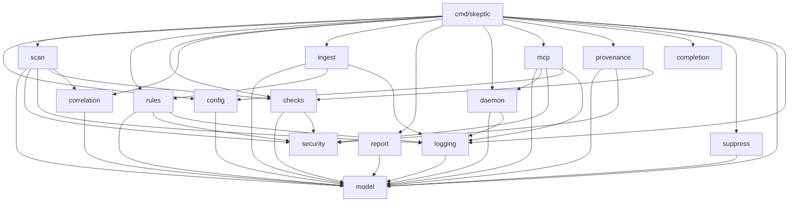
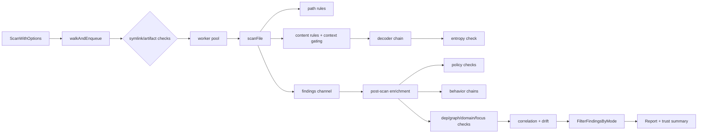
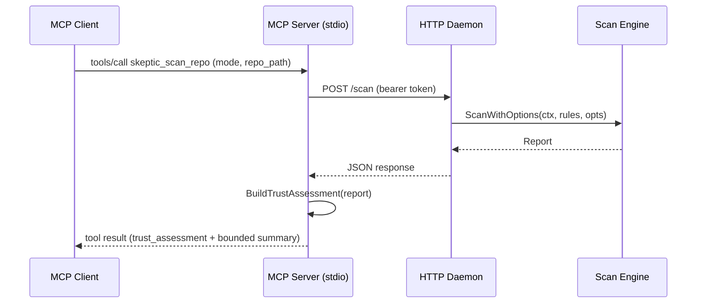

# Documentation Lifecycle

## Scope

This skill covers three documentation surfaces:

1. **Module docs** — per-package reference pages under `docs/modules/<package>.md`
2. **Top-level docs** — `docs/ARCHITECTURE.md` and `README.md` kept in sync with code
3. **Mermaid diagrams** — data-flow, block-diagram, and dependency-graph visuals embedded in markdown

## Required Context

Before generating or updating documentation, read:

- `docs/ARCHITECTURE.md` — current module layout, dependency graph, confidence taxonomy, operating modes, design decisions
- `README.md` — user-facing feature list, CLI reference, folder layout
- `AGENTS.md` — hard constraints (stdlib-only, single binary, RE2 regex, etc.), model types including `ConfidenceClass` and `ScanMode`
- `docs/product-shaping-memo.md` — product-shaping decisions, what changed, what remains weak

## Module Documentation Layout

Each internal package and cmd entry gets a page under `docs/modules/`.

### Module Doc Template

Each `docs/modules/<package>.md` follows this structure:

```markdown
# <package>

> One-line purpose statement.

## Responsibility

2-4 sentences describing what this package owns and why it exists as a
separate module.

## Public API

Table of exported functions, types, and constants that callers depend on.
Include signature, return type, and a brief description.

| Symbol | Signature | Description |
|--------|-----------|-------------|
| ... | ... | ... |

## Internal Design

Key data structures, algorithms, concurrency model, or non-obvious design
choices. Keep to what a contributor needs to modify the package safely.

## Dependencies

Which internal packages this module imports and why.

## Data Flow

Mermaid diagram showing how data enters, transforms, and exits this module.

## Test Surface

Summary of colocated test files, what they cover, and how to run them.

## Related Docs

Links to ARCHITECTURE.md sections, CONFIGURATION.md keys, or other module
docs that interact with this package.
```

## Operations

### 1) Generate Module Doc

Create a new `docs/modules/<package>.md` for a package that has none.

1. Read all `.go` files in the target package (skip `_test.go` for API surface; include for test summary).
2. Extract exported symbols, doc comments, struct fields, and function signatures.
3. Identify intra-project imports from `import` blocks to build the dependency list.
4. Trace data flow: what calls into this package (search callers) and what it calls.
5. Write the doc using the template above.
6. Generate a Mermaid `flowchart` or `sequenceDiagram` for the data-flow section.
7. If the package introduces a new public surface not reflected in `ARCHITECTURE.md`, update it.

### 2) Update Module Doc

Refresh an existing `docs/modules/<package>.md` after code changes.

1. Re-read the package source to detect new/removed/changed exports.
2. Diff against the existing doc and apply minimal updates.
3. Regenerate diagrams if data flow or dependencies changed.
4. Update `ARCHITECTURE.md` and `README.md` only if structural changes warrant it.

### 3) Update ARCHITECTURE.md

Trigger when:

- A new `internal/` package is added or removed
- The dependency graph changes (new import edges)
- The rules layout table changes (new group files)
- The scan engine pipeline gains or loses a stage
- The testing strategy section drifts from reality
- Confidence taxonomy, operating mode, or gate policy logic changes
- New exported API surface in `model` (e.g., `ConfidenceClass`, `ScanMode`, `IsGateEligible`, `FilterFindingsByMode`)
- MCP tool interface changes (new parameters, new output sections like `trust_assessment`)

Workflow:

1. Read all `internal/*/` package directories and their imports.
2. Compare against the current `docs/ARCHITECTURE.md` content.
3. Update the module layout block, dependency graph, rules layout table, and any prose that references changed structure.
4. Regenerate the dependency Mermaid diagram if edges changed.

### 4) Update README.md

Trigger when:

- A new subcommand is added
- CLI flags change (new flag, removed flag, changed default)
- A new scan style, threat mode, operating mode, or output format is added
- The folder layout changes
- Feature list in "What You Get" drifts from reality
- Confidence taxonomy or operating mode behavior changes
- MCP trust assessment output shape changes

Workflow:

1. Read `cmd/skeptic/main.go` and `perform_skeptic_run.go` for subcommands and flags.
2. Compare against `README.md` sections.
3. Update only the sections that drifted; preserve existing prose style.

### 5) Generate Diagrams

Produce Mermaid diagrams and embed them in the appropriate doc.

#### Dependency Graph (block diagram)

Embed in `docs/ARCHITECTURE.md` and/or a standalone `docs/diagrams/dependency-graph.md`.



#### Scan Pipeline Data Flow

Embed in `docs/modules/scan.md`.



#### Daemon/MCP Data Flow

Embed in `docs/modules/daemon.md` or `docs/DAEMON_MCP_DESIGN.md`.



### 6) Audit Documentation Freshness

Periodic check that docs match code reality.

1. List all `internal/` packages; flag any without a `docs/modules/<pkg>.md`.
2. Compare `ARCHITECTURE.md` module list against actual `internal/` directories.
3. Compare `README.md` subcommand list against `main.go` dispatch switch.
4. Compare `README.md` flag list against flag registration in `perform_skeptic_run.go`.
5. Report drift items for the user to approve before updating.

## Diagram Conventions

- Use `graph TD` (top-down) for dependency/block diagrams.
- Use `flowchart LR` (left-right) for pipeline/data-flow diagrams.
- Use `sequenceDiagram` for request/response interaction flows.
- Keep node labels short (package name or function name, not full paths).
- Use subgraphs to group related packages (e.g., `subgraph Detection` for scan/rules/checks).
- Embed diagrams directly in the relevant markdown doc inside fenced `mermaid` blocks.
- For large diagrams that clutter a module doc, place them in `docs/diagrams/<name>.md` and link from the module doc.

## Validation

After any documentation change:

1. Verify all internal links resolve (no broken `docs/modules/*.md` references).
2. Verify Mermaid blocks parse (paste into any Mermaid live editor or use `mmdc` if available).
3. Verify `ARCHITECTURE.md` dependency graph matches actual Go imports:
   ```bash
   go list -f '{{.ImportPath}} -> {{join .Imports ", "}}' ./internal/...
   ```
4. Verify `README.md` subcommand list matches `main.go`:
   ```bash
   grep -E 'case "' cmd/skeptic/main.go
   ```

## Guardrails

- Do not fabricate API surfaces; always read source before documenting.
- Do not add doc comments to code as part of this workflow; this skill produces standalone docs only.
- Keep module docs factual and concise; avoid marketing language.
- Preserve existing prose style in `README.md` and `ARCHITECTURE.md` when updating.
- When updating top-level docs, make minimal targeted edits rather than rewriting sections wholesale.
- If a diagram would exceed ~30 nodes, split into focused sub-diagrams.
