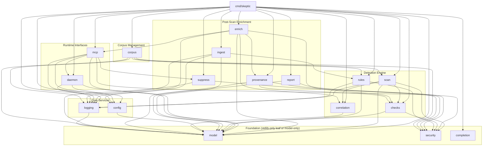
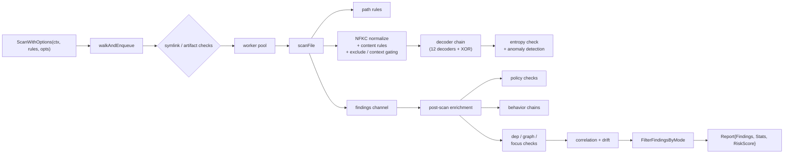
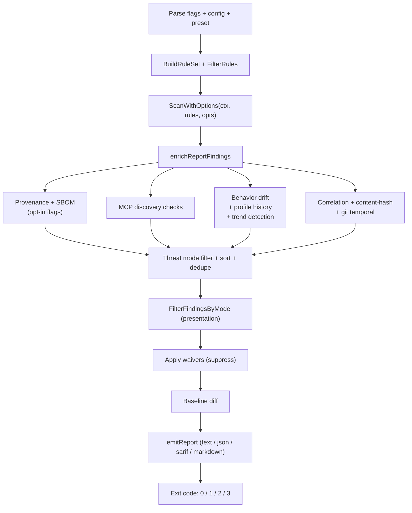
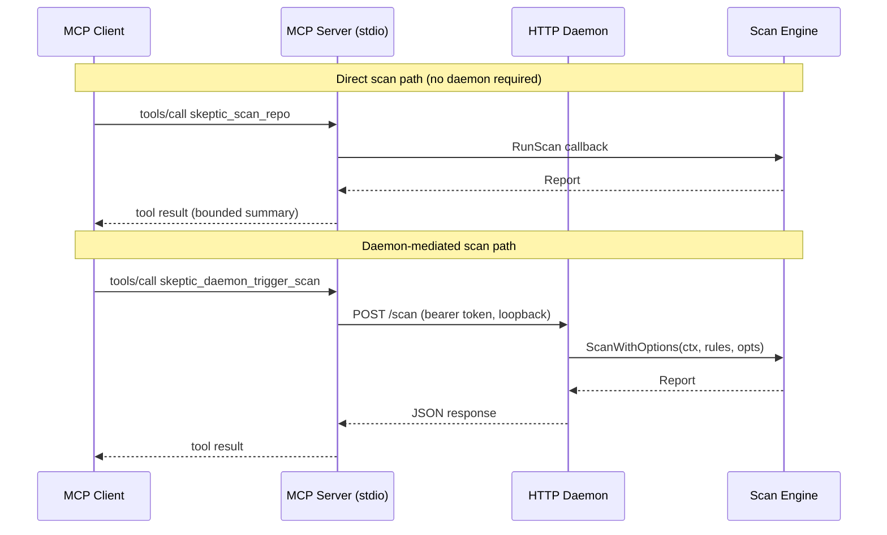

# Architecture

Last updated: 2026-08-09  
Dependency graph verified: 2026-08-09

## Module Layout

`skeptic` is a single Go module (`github.com/TGPSKI/skeptic`) at the repository root. It builds as one binary from `cmd/skeptic/` and keeps all domain logic in `internal/` packages.

```text
go.mod                          # module github.com/TGPSKI/skeptic, stdlib-only
rulepacks/                      # curated external rule packs; signing material under rulepacks/signing/; campaign packs under rulepacks/campaigns/<name>/ (rules JSON + .sig); see rulepacks/README.md
cmd/skeptic/
  main.go                       # CLI entry, subcommand dispatch, global flag extraction
  perform_skeptic_run.go        # default scan path: flag parsing, config/preset merge, enrichment, report
  profiling.go                  # CPU/mem/trace profiling helpers (startProfiling, globalProfileAndStop)
  cli_helpers.go                # shared CLI utilities: output format/policy parsing, report emission, path resolution, global-flag merging
  serve_cmd.go                  # serve subcommand wiring (runServeGlobal, executeDaemonScanForServe)
  mcp.go                        # mcp subcommand wiring
  bundle_cmd.go                 # bundle/verify-bundle subcommands
  export_evidence_cmd.go        # export-evidence subcommand
  waive_cmd.go                  # waive subcommand
  corpus_cmd.go                 # corpus subcommand dispatch (init/fetch/info/scan/purge)
  *_test.go                     # unit tests, benchmarks, integration tests (package main)
internal/
  model/          # shared domain types: Severity, Finding, Rule, Report, ScanOptions, ConfidenceClass, ScanMode
  logging/        # structured logger with verbosity levels
  security/       # redaction, hashing, integrity helpers
  rules/          # built-in rules (229), rulepack loading, signing, quality validation, rule-pack test runner
  config/         # config file loading, presets, init, config show/use, system config, XDG profile management
  checks/         # dep_checks, domain_checks (structural domain typosquat: DOM-TYPO-*), graph (graph.go, graph_azure.go, graph_gcp.go, graph_rbac.go), policy, behavior, focus checks
  scan/           # scan engine (ScanWithOptions), payload decoders (12 schemes + XOR brute), incremental cache, pre-filter, NFKC normalization, risk scoring, entropy anomaly detection, polyglot detection
  correlation/    # cross-finding correlation (per-dir + repo-level), drift detection, temporal/git correlation
  enrich/         # post-scan enrichment pipeline (dependency checks, identity graph, provenance, SBOM, MCP discovery, behavior drift, git correlation)
  ingest/         # threat-intel ingestion (STIX, Sigma, YARA, URL)
  report/         # SARIF, JSON, markdown, text output; baseline, evidence export, bundles
  provenance/     # dependency provenance hash verification (6 ecosystems), Ed25519-signed manifests, SBOM cross-referencing
  completion/     # shell completion generation (bash, zsh, fish)
  daemon/         # HTTP daemon, scheduler, fs-watch, client helpers
  mcp/            # MCP JSON-RPC server (mcp.go, mcp_tools.go, mcp_ingest.go, mcp_auto_daemon.go), discovery
  suppress/       # waiver JSON load/validate, ApplyWaivers, SHA256 file pinning (security.SHA256FileHex), RunWaive (waive.go)
  corpus/         # encrypted-at-rest .md corpus for agentic rule validation (AES-256-GCM, path safety, manifest integrity, isolated scan)
```

## Rules Source Layout

Built-in rules are split across themed files under `internal/rules/`. The package also contains infrastructure files for rule pack loading, signing, and quality enforcement. **Campaign packs** (IOC literals and other signed overlays) live under `rulepacks/campaigns/<campaign>/` as `rules.<date>.json` with a sibling `rules.<date>.json.sig`, and optionally `rules.test.<date>.json` for pack-level match assertions. Structural domain typosquat findings (`DOM-TYPO-001`–`003`) are emitted by `internal/checks/domain_checks.go` (string comparison against known vendor domains), not by regex rules in this table.

**“Nobody reviews this”** is a first-class detection category: low-review surfaces such as packaging metadata, build/config files, lockfiles, IDE config, HTML comments, editor backups, and OS metadata—covered in part by `AGT-TRUST-007`–`018` alongside existing non-code and agentic rules.

### Rule Group Files

| File | Rules | Role |
|------|-------|------|
| `rules_behavioral_signals.go` | 82 | Encoded payload, obfuscation, CI abuse, container escape, structural exfil/memory/sweep/stego signals (`CI-EXFIL-*`, `ATK-MEM-*`, `ATK-SWEEP-*`, `ENC-STEGO-*`, …), and related behavioral patterns |
| `rules_agentic_surfaces.go` | 67 | Agentic/LLM poisoning surfaces, MCP abuse patterns, trust-laundering (`AGT-TRUST-001`–`018`, including “nobody reviews this” surfaces), memory poisoning, tool-output injection |
| `rules_non_code_surfaces.go` | 28 | Non-code attack surfaces: git metadata, package-manager config, IDE/devcontainer vectors, plus structural CI/SCM workflow signals (`CI-PRT-*`, `SCM-TAG-*`) |
| `rules_identity_exposure.go` | 7 | IaC and machine-identity policy risk signals |
| `rules_attack_tactics.go` | 45 | ATT&CK tactic coverage heuristics (`ATK-K8S-*`, `ATK-PER-*`, `ATK-IMDS-*`, `ATK-C2-*`, `ATK-WIPER-*`, …) |

### Infrastructure Files

| File | Role |
|------|------|
| `rules_core.go` | `DefaultRules()` composition, regex compilation, `LiteralHint` extraction and application, `FilterRules`, `BuildRuleSet`; rules may set `Rule.ExcludePattern` for negative filtering at match time |
| `rulepacks.go` | External rule pack loading (`LoadRulesFromFile`), `CompileRuleSpecs`, rule set merging and deduplication |
| `signatures.go` | Ed25519 signing (`SignRulepackFile`), verification (`VerifyRulepackFileSignature`), multi-key policy, keypair generation |
| `rule_quality.go` | `EnforceRuleQuality` validation, `ParseRuleQualityMode`, pattern breadth and ID format checks |
| `rulepack_test_runner.go` | `RunRulePackTests`, `CollectTestFiles` — loads companion `rules.test.*.json` packs next to rule JSON and asserts should_match / should_not_match per rule |

### Composition Order

`DefaultRules()` in `rules_core.go` assembles rules from 6 unexported functions across 5 group files:

1. Behavior and payload construction signals (`behavioralSignalsRules` in `rules_behavioral_signals.go`)
2. Agentic ecosystem and trust-laundering surfaces (`agenticSurfacesRules` in `rules_agentic_surfaces.go`)
3. Non-code and workflow surfaces (`nonCodeSurfacesRules` in `rules_non_code_surfaces.go`)
4. Identity and IaC / machine-identity policy signals (`infrastructureCredentialExposureRules`, `machineIdentityPolicyRules` in `rules_identity_exposure.go`)
5. Broad ATT&CK tactic coverage heuristics (`attackTacticsRules` in `rules_attack_tactics.go`)

Campaign IOC literals (TeamPCP and similar) live in signed external packs under `rulepacks/campaigns/<campaign>/` (for example `teampcp/rules.2026-03-28.json` with a sibling `.sig`), not in the built-in Go sources.

After assembly, all patterns are compiled with `regexp.MustCompile` and `ApplyLiteralHints` extracts static keyword prefixes for Aho-Corasick pre-filtering.

See [RULESET_GROUPING.md](RULESET_GROUPING.md) for the full grouping strategy and rationale.

## Confidence taxonomy

Each `Finding` carries a `ConfidenceClass`: `definitive`, `heuristic`, or `correlated`. By default the class comes from the rule ID prefix via `DefaultConfidenceForRuleID` (structural “wedge” prefixes such as `SCM-`, `AGT-TRUST-`, `GRAPH-` are definitive; `COR-` / `DRIFT-` are correlated; remaining rules default to heuristic). Rules may override `ConfidenceClass` in metadata. Correlation and drift findings are emitted as `correlated`.

This taxonomy is orthogonal to severity: it describes epistemic strength for trust-weighted reporting, not raw risk alone.

## Operating modes (`ScanMode`)

Three modes—`developer` (default), `ir`, and `deep`—sit **above** presets in config resolution. Each mode applies a small bundle of defaults (`ModePresetValues` in `internal/config`): e.g. `developer` sets hybrid scan style, policy checks on, and `fail-on` critical; `ir` and `deep` default `fail-on` to `none` so runs are advisory unless overridden.

Modes compose with scan style (`pattern` \| `behavior` \| `hybrid`), threat mode (`all` \| `machine-identity` \| `ai-workload`), and `--fail-on` as follows: mode defaults apply first for unset flags, then preset, then config file, then explicit CLI (see [CONFIGURATION.md](CONFIGURATION.md)).

**Gating:** `IsGateEligible` limits which rule families can contribute to exit-code failure in `developer` mode. Eligibility is declared alongside confidence in the `ruleFamilies` table in `internal/model/model.go`; the wedge families are `SCM-`, `CI-PRT-`, `CI-EXFIL-`, `CI-ABUSE-`, `CI-SECRET-`, `POL-GHA-`, `AGT-*` skill/memory/trust surfaces, `GRAPH-`, `CLOUD-ID-`, `DISC-MCP-`, and `DOM-TYPO-`. A test enforces that a definitive family either gates or records an `UngatedReason`. In `ir` and `deep`, no rule family is gate-eligible—`--fail-on` still runs but only gate-eligible findings count toward threshold, so these modes stay advisory unless you switch mode or change eligibility semantics later.

When a run passes but findings at or above `--fail-on` were excluded by eligibility, the CLI logs a `WARN` naming the rule IDs.

**Presentation filtering:** After detection and enrichment, `FilterFindingsByMode` may narrow the findings attached to the report. In `developer`, definitive and correlated findings are always shown; heuristic findings appear only at critical severity. In `ir` and `deep`, all severities are shown. This is a **presentation** decision—the engine still runs the full pipeline; filtering runs after correlation on the collected finding set.

## Dependency Graph

Dependencies flow downward. No circular imports exist. Verified against `go list -f '...' ./internal/...` and `./cmd/skeptic/`.

```text
cmd/skeptic
  |- internal/config
  |- internal/enrich
  |- internal/ingest
  |- internal/correlation
  |- internal/daemon
  |- internal/mcp
  |- internal/report
  |- internal/rules
  |- internal/scan
  |- internal/checks
  |- internal/provenance
  |- internal/completion
  |- internal/suppress
  |- internal/corpus
  |- internal/model
  |- internal/logging

internal/scan       -> model, security, logging, checks, correlation
internal/daemon     -> model, config, logging
internal/mcp        -> model, daemon, security, config, logging, suppress
internal/enrich     -> model, checks, correlation, provenance, mcp, logging
internal/checks     -> model, security
internal/rules      -> model, security, logging
internal/ingest     -> model, config, rules, logging
internal/report     -> model, security
internal/config     -> model
internal/correlation -> model
internal/provenance -> model, security, checks
internal/suppress   -> model, security
internal/corpus     -> model, security, scan, rules, logging
internal/logging    -> model
internal/completion -> (stdlib only)
internal/model      -> (stdlib only)
internal/security   -> (stdlib only)
```



Note: `cmd/skeptic` does not import `internal/security` directly; it accesses redaction and hashing transitively through `scan`, `rules`, and `checks`. The `checks` package combines dependency and identity graph analysis with structural domain comparison for typosquat detection (`domain_checks.go`).

## Scan Engine

The primary scan entrypoint is `internal/scan.ScanWithOptions`, invoked from `perform_skeptic_run.go` and daemon/MCP wiring. It performs:

1. File traversal with profile-based directory skipping
2. Worker pool dispatch (configurable `--workers`, defaults to `NumCPU`); walk and workers honor `context.Context` cancellation
3. Symlink and residual-artifact checks (`SCM-SYM-*`, `SCM-TEMP-*`) before generic rule passes
4. Per-file rule matching (regex against content or path), including optional **`ExcludePattern`** (drop a candidate match when the match line matches the exclude regex) and optional **context gating** via `Rule.ContextPattern` / `Rule.ContextWindow` (co-occurrence in a line window)
5. **NFKC normalization** (default on, `--nfkc`) — stdlib-only subset covering fullwidth→ASCII, zero-width stripping, and Cyrillic/Greek homoglyphs to defeat Unicode evasion
6. **Aho-Corasick pre-filtering** via `LiteralHint` keywords — files with no literal-hint matches skip the regex phase entirely
7. **Polyglot detection** on file prefix — binary magic bytes (PE, ELF, PDF, ZIP, gzip, PNG, JFIF) emit `ENC-POLYGLOT-001`
8. Payload decoding chain (base64, base32, hex, URL, gzip, zlib, PowerShell, Unicode, HTML, ROT13, quoted-printable, PEM) with configurable depth (`--max-decode-depth`), per-layer **confidence** decay, entropy-based bonus recursion, and optional **XOR brute-force** (`--xor-brute`)
9. **Entropy anomaly detection** — sliding-window analysis emits `ENC-ENTROPY-001` for files with 3+ high-entropy regions
10. Post-scan enrichment: policy checks, behavior chains, focus checks, dep checks, domain typosquat checks (`DOM-TYPO-*`), graph checks (AWS, Azure, GCP, K8s, OIDC)
11. Correlation engine: per-directory (COR-001–003), repo-level (COR-004, COR-005), content-hash grouping, git temporal correlation (COR-TEMPORAL-001), and optional drift detection (DRIFT-001–004, DRIFT-TREND-001)
12. **Confidence propagation** — each finding gets `ConfidenceClass` from the rule (or `DefaultConfidenceForRuleID` / correlation emitters)
13. **Mode filtering** — `FilterFindingsByMode` applies `ScanOptions.Mode` before the report is finalized (presentation only)
14. Aggregate **risk score** (0–100 with diminishing returns per severity) computed in `finalizeReport`
15. Report generation (text, JSON, SARIF, markdown) including trust summary in text/markdown, and incremental cache update



**Model surface used by the pipeline:** `Rule.ExcludePattern`; `Rule.ContextPattern` / `ContextWindow` / `Remediation`; `Finding.Confidence`, `Finding.ConfidenceClass`, `Finding.Suppressed`, `Finding.SuppressionReason`, `Finding.Remediation`; `Report.RiskScore`, `Report.Mode`, `Report.FindingsByConfidence`; `ScanOptions.IncludeRules`, `ExcludeRules`, `IgnorePaths`, `NFKC`, `AhoCorasick`, `ToolName`, `XORBrute`, `MaxDecodeDepth`, and `Mode` (`ScanMode`) are defined on `model.ScanOptions` for filtering and scan behavior.

**Stable finding identity for baselines and SARIF:** `report.FindingIdentityKey` uses rule id, file path, and a SHA256 prefix of the match text (line-independent). Legacy line-based keys remain available as `FindingIdentityKeyV1` for migrating old baselines.

## Full CLI Pipeline

`performSkepticRun` in `cmd/skeptic/` orchestrates the end-to-end scan path. Several steps happen outside the engine:



Steps 1-9 from the Scan Engine section run inside `ScanWithOptions`. After it returns, `performSkepticRun` adds provenance verification, MCP auto-discovery, behavior drift analysis, additional correlation passes, waiver suppression, baseline diffing, and final report output. See [cli module doc](modules/cli.md) for the detailed pipeline breakdown.

## Breaking Circular Dependencies

`main.go` owns the scan function but `daemon` and `mcp` need to trigger scans. This is resolved with callback types:

- `daemon.ScanFunc` — passed to `daemon.RunServe` from `main.go`
- `mcp.Options.RunScan` — passed to `mcp.RunMCP` from `main.go`

Neither `daemon` nor `mcp` imports `cmd/skeptic`.

## Daemon / MCP Interaction

MCP operates in two modes depending on configuration: direct scan (calling `RunScan` callback) or daemon-mediated scan (HTTP POST to the daemon API).



MCP also exposes **`skeptic_waive`** (`internal/mcp/mcp_tools.go`), which runs `suppress.RunWaive` to append waiver entries (with optional SHA256 pinning) to the configured waivers file.

## Testing Strategy

Tests are organized by proximity:

- **Colocated internal tests**: `internal/<pkg>/<pkg>_test.go` — unit tests for each package in isolation
- **CLI and integration tests**: `cmd/skeptic/*_test.go` — CLI behavior, config loading, format output
- **Integration tests** (build tag `integration`), split across `cmd/skeptic/integration_daemon_test.go`, `integration_scan_test.go`, `integration_perf_test.go`, `integration_pipeline_test.go`, `integration_corpus_test.go`, with shared helpers in `integration_helpers_test.go` — daemon/MCP protocol, scan/corpus/decoders, performance and stress, full pipeline, rule filters, path ignore, waivers, corpus lifecycle
- **Benchmarks**: `cmd/skeptic/bench_test.go` — rule compilation, scan, decode layers, ingest parsers, correlation, edit distance, feed format
- **Fuzz tests**: `internal/scan/decoders_fuzz_test.go`, `internal/mcp/mcp_fuzz_test.go`, `internal/ingest/ingest_fuzz_test.go`

### CLI Test Files

| File | Scope |
|------|-------|
| `cli_test.go` | Validation errors, JSON/SARIF output, subcommand dispatch, corpus scan validation |
| `config_test.go` | Config auto-load, preset precedence |
| `policy_level_test.go` | Version subcommand |
| `main_helpers_test.go` | Format/policy parsing, path canonicalization, scan root resolution, global flag extraction/merging, hex prefix detection, positional arg handling |
| `bench_test.go` | Rule compilation, scan, decode layers, ingest parsers, correlation, edit distance, feed format |
| `proof_corpus_test.go` | Proof corpus trust-audit validation: 34 fixtures with `BuildTrustAssessment` verdict assertions |
| `rulepack_corpus_test.go` | Rule-pack JSON under `rulepacks/campaigns/` — signature verification and `RunRulePackTests` |
| `integration_daemon_test.go` | MCP + daemon HTTP end-to-end, concurrent daemon-triggered scans |
| `integration_scan_test.go` | Small corpus, decoders, provenance, correlation |
| `integration_perf_test.go` | Incremental cache, worker scaling, large corpus, incremental stress |
| `integration_pipeline_test.go` | Full pipeline, concurrent scan safety, rule include/exclude, path ignore, waiver suppression, config lifecycle |
| `integration_corpus_test.go` | Corpus lifecycle, duplicate init, non-markdown fetch |
| `integration_helpers_test.go` | Shared helpers (binary build, daemon/MCP clients, corpus fixtures); not a test file by itself |

Run coverage:

```bash
make coverage     # all packages
make test         # unit tests
make integration  # process-level integration tests
make bench        # benchmarks
```

## Key Design Decisions

- **stdlib-only**: zero third-party dependencies, single static binary
- **RE2 regex**: Go's regexp package; no PCRE features
- **Not a secret scanner**: leaked-credential hunting is out of scope—use [Gitleaks](https://github.com/gitleaks/gitleaks) or similar. Findings may still flag structural conditions that *expose* secrets in CI. **Secret redaction by default**: match text passes through `security.SanitizeMatch` before storage
- **Severity calibration**: example—campaign IOC rules in external packs at medium; `CI-SECRET-*` and broad ATT&CK tactic rules (`ATK-EXE`, `ATK-DEF`, `ATK-C2`, `ATK-COL`, …) at low where tuned for noise versus structural misconfigurations
- **Config-first UX**: auto-discovery of `.skeptic.json|yaml|env` files in cwd with fallback to active named profile under `$XDG_DATA_HOME/skeptic/profiles/`; system config (`system.json`) for infra settings loads underneath; **`skeptic init`** scaffolds the XDG directory, system config, and starter profile; **`skeptic config show/use`** manage named profiles
- **Loopback-only defaults**: daemon and MCP bind to 127.0.0.1 by default
- **Property-based rule grouping**: rules grouped by detection surface/function, not chronological phase
- **Callback-based wiring**: `ScanFunc` and `RunScanFunc` break import cycles without interface registries

## Module Documentation

Per-package reference docs with public API tables, data-flow diagrams, dependency lists, and test surface summaries live under `docs/modules/`:

| Doc | Package |
|-----|---------|
| [scan.md](modules/scan.md) | `internal/scan` |
| [rules.md](modules/rules.md) | `internal/rules` |
| [model.md](modules/model.md) | `internal/model` |
| [checks.md](modules/checks.md) | `internal/checks` |
| [correlation.md](modules/correlation.md) | `internal/correlation` |
| [enrich.md](modules/enrich.md) | `internal/enrich` |
| [ingest.md](modules/ingest.md) | `internal/ingest` |
| [report.md](modules/report.md) | `internal/report` |
| [daemon.md](modules/daemon.md) | `internal/daemon` |
| [mcp.md](modules/mcp.md) | `internal/mcp` |
| [config.md](modules/config.md) | `internal/config` |
| [security.md](modules/security.md) | `internal/security` |
| [logging.md](modules/logging.md) | `internal/logging` |
| [suppress.md](modules/suppress.md) | `internal/suppress` |
| [provenance.md](modules/provenance.md) | `internal/provenance` |
| [completion.md](modules/completion.md) | `internal/completion` |
| [corpus.md](modules/corpus.md) | `internal/corpus` |
| [cli.md](modules/cli.md) | `cmd/skeptic` |

See `AGENTS.md` for the full set of constraints and conventions.
