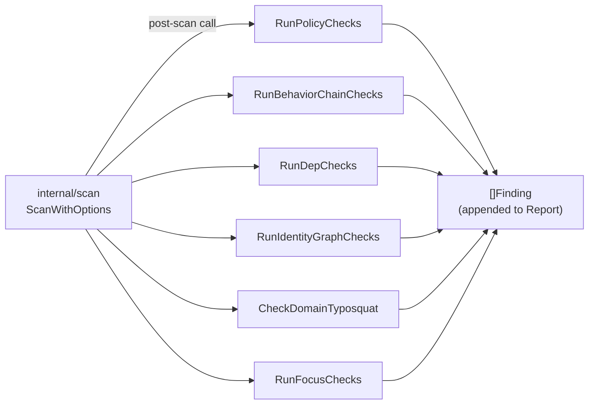

# checks

> Post-scan enrichment: policy checks, behavior chains, dependency analysis, identity graphs, and focus checks.

## Responsibility

`internal/checks` runs after the scan engine's regex pass and adds domain-specific detections that require full-file context, multi-step reasoning, or structured data parsing. It covers six check families: file-aware policy checks, multi-step behavior chains, dependency manifest analysis, vendor-domain typosquat checks (`domain_checks.go`), IAM/RBAC/OIDC identity graph checks, and focused machine-identity / AI-workload checks.

## Public API

### Policy Checks

| Symbol | Signature | Description |
|--------|-----------|-------------|
| `RunPolicyChecks` | `(absPath, fileLabel string, lines []string, content string, redactSecrets bool) []model.Finding` | File-aware trust and integrity checks: workflow pin verification, pip/npm dependency integrity, cloud identity wildcards. |

### Behavior Chains

| Symbol | Signature | Description |
|--------|-----------|-------------|
| `BehaviorChainSpec` | `struct{ID, Title, Description, Category, Mitre string; Severity model.Severity; Steps []*regexp.Regexp; Ordered bool}` | Multi-step chain definition with optional ordered-step enforcement. |
| `BehaviorChainSpecs` | `var []BehaviorChainSpec` | All built-in chain definitions (18 chains including `BHV-ORD-*` and `BHV-DEPBOT-*`). |
| `RunBehaviorChainChecks` | `(fileLabel, content string, redactSecrets bool) []model.Finding` | Evaluates all behavior chains against full file content. |
| `FirstMatchLine` | `(content string, re *regexp.Regexp) int` | Earliest matching line number for stable finding locations. |
| `FirstMatchText` | `(content string, re *regexp.Regexp) string` | Representative snippet for chain findings. |

### Dependency Checks

| Symbol | Signature | Description |
|--------|-----------|-------------|
| `RunDepChecks` | `(scanRoots []string, redactSecrets bool) []model.Finding` | Scans lockfiles for confusion, typosquat, and phantom dependencies. |
| `DiscoverManifests` | `(roots []string) []ManifestEntry` | Walks roots for known manifest filenames. |
| `CheckManifest` | `(path, ecosystem string, redactSecrets bool) []model.Finding` | Per-manifest ecosystem checks. |
| `CheckNPMManifest` | `(data []byte, fileLabel string, redact bool) []model.Finding` | npm-specific dependency checks. |
| `CheckPyPIManifest` | `(data []byte, fileLabel string, redact bool) []model.Finding` | PyPI-specific dependency checks. |
| `IsSuspiciousTyposquat` | `(name, ecosystem string) bool` | Edit-distance-2 check against popular packages. |
| `EditDistance` | `(a, b string) int` | Levenshtein distance. |
| `MinInt` | `(a, b int) int` | Integer minimum for edit distance computation. |
| `PopularPackages` | `var map[string][]string` | Known popular package names per ecosystem for typosquat comparison. |

### Identity Graph

| Symbol | Signature | Description |
|--------|-----------|-------------|
| `RunIdentityGraphChecks` | `(scanRoots []string, maxHops int, redactSecrets bool) []model.Finding` | Scans IAM, RBAC, OIDC configs for short privilege-escalation paths. |
| `IdentityGraph` | `struct{Nodes, Edges, adj}` | Unified identity graph with `BFS` and `BlastRadius` methods. |
| `IdentityNode` | `struct{ID, Type, Label string}` | Node in the identity graph (IAM principal, role, service). |
| `IdentityEdge` | `struct{From, To, Label string}` | Directed edge in the identity graph. |
| `GraphNode` | `struct{ID, Type string}` | Simplified graph node for BFS results. |
| `RBACEntity` | `struct` | Parsed K8s RBAC entity (role, binding, webhook). |
| `RBACSubject` | `struct{Kind, Name, Namespace string}` | K8s RBAC subject reference. |
| `WebhookPolicyEntry` | `struct{Name, FailurePolicy string}` | K8s webhook with failure policy. |
| `ManifestEntry` | `struct{Path, Ecosystem string}` | Discovered lockfile/manifest path with ecosystem tag. |
| `DepCheckResult` | `struct` | Dependency check finding result. |
| `CheckIAMPolicy` | `(path, content string, maxHops int, redact bool) []model.Finding` | AWS IAM JSON policy evaluation. |
| `CheckK8sRBAC` | `(path, content string, maxHops int, redact bool) []model.Finding` | Kubernetes RBAC YAML evaluation with regex-parsed bindings. |
| `CheckOIDCFederation` | `(path, content string, redact bool) []model.Finding` | OIDC audience constraint evaluation (GRAPH-003) and GitHub Actions subject condition checks (GRAPH-008). |
| `K8sRBACIdentityGraphFindings` | `(entities []RBACEntity, maxHops int, redact bool) []model.Finding` | BFS-based `GRAPH-002` wildcard reachability and `GRAPH-009` wildcard verbs on secrets. |
| `K8sWebhookFailurePolicyFindings` | `(entities []RBACEntity, redact bool) []model.Finding` | `GRAPH-010` for Validating/Mutating webhooks with `failurePolicy: Ignore`. |
| `CheckAzureRoleAssignment` | `(path, content string, redact bool) []model.Finding` | `GRAPH-006` for Azure Owner/Contributor role assignments. |
| `CheckGCPIAMBinding` | `(path, content string, redact bool) []model.Finding` | `GRAPH-007` for GCP IAM bindings granting `roles/owner` or `roles/editor` to `allUsers`/`allAuthenticatedUsers`. |

### Domain Typosquat Checks

| Symbol | Signature | Description |
|--------|-----------|-------------|
| `KnownVendorDomains` | `var []string` | List of canonical vendor domains checked for typosquat proximity. |
| `VendorOwnedAltDomains` | `var map[string]string` | Maps vendor-owned alternate TLD zones (e.g. `github.io`, `docker.io`) to a canonical domain. Used so legitimate first-party alternate domains do not fire `DOM-TYPO-002`. |
| `CheckDomainTyposquat` | `(fileLabel, content string, redactSecrets bool) []model.Finding` | Detects vendor-domain impersonation in URLs and network-relevant literals. Emits `DOM-TYPO-001` (vendor lookalike domain), `DOM-TYPO-002` (exact vendor domain impersonation in suspicious context), `DOM-TYPO-003` (non-standard TLD for known vendor domain). |

### Focus Checks

| Symbol | Signature | Description |
|--------|-----------|-------------|
| `RunFocusChecks` | `(absPath, fileLabel string, lines []string, content string, redactSecrets bool, mode model.ThreatMode) []model.Finding` | Machine-identity (`MID-*`) and AI-workload (`AIW-*`) domain checks. |
| `HasOIDCAudienceBinding` | `(content string) bool` | Tests whether OIDC config content contains audience binding. |
| `IsYAMLPath` | `(lower string) bool` | Tests whether a lowercased path is a YAML file. |
| `IsShellLikeOrEnvPath` | `(lower string) bool` | Tests whether a lowercased path is a shell script or env file. |
| `IsDockerComposeOrAIConfigPath` | `(lower string) bool` | Tests whether a lowercased path is a Docker Compose or AI config file. |
| `AIW102ModelServingWithoutAuth` | `(content string) bool` | Detects model serving endpoints without authentication. |
| `AIW103PromptLogNoRetention` | `(content string) bool` | Detects prompt logging without retention policies. |

## Internal Design

Each check family is a standalone file with its own regex compilations at package level. Behavior chains support both unordered (all steps present anywhere) and ordered (steps in line order) matching. The identity graph uses BFS with a configurable hop budget (`--identity-graph-hops`) to find privilege escalation paths. RBAC parsing uses regex extraction from YAML (no external YAML library) to build `RBACEntity` structs.

### Domain typosquat

For `DOM-TYPO-002`, `checkTLDSwap` consults `VendorOwnedAltDomains`: if the candidate `body.tld` is a known vendor-owned alternate zone, no TLD-swap finding is emitted.

### Identity Graph Findings (GRAPH-001–010)

| ID | Source File | Detection |
|----|-------------|-----------|
| GRAPH-001 | `graph.go` | AWS IAM wildcard `Action: *` / `Resource: *` |
| GRAPH-002 | `graph_rbac.go` | K8s RBAC BFS path to wildcard resources |
| GRAPH-003 | `graph.go` | OIDC federation missing audience constraint |
| GRAPH-004 | `graph.go` | IAM assume-role chain to wildcard resource |
| GRAPH-005 | `graph.go` | Cross-file IAM merging: multi-file assume-role chains to wildcard resources |
| GRAPH-006 | `graph_azure.go` | Azure Owner/Contributor role assignment |
| GRAPH-007 | `graph_gcp.go` | GCP IAM binding granting owner/editor to allUsers/allAuthenticatedUsers |
| GRAPH-008 | `graph.go` | GitHub Actions OIDC with wildcard or missing `sub` claim |
| GRAPH-009 | `graph_rbac.go` | K8s role with wildcard verbs on secrets |
| GRAPH-010 | `graph_rbac.go` | Validating/Mutating webhook with `failurePolicy: Ignore` |

## Dependencies

| Package | Why |
|---------|-----|
| `internal/model` | `Finding`, `Severity`, `ThreatMode` types |
| `internal/security` | `SanitizeMatch` for redaction in finding output |

## Data Flow



## Test Surface

| File | Tests |
|------|-------|
| `behavior_checks_test.go` | Chain detection, ordered chains (in-order and out-of-order), OIDC exclusion, `FirstMatchLine`/`FirstMatchText` |
| `dep_checks_test.go` | Edit distance, typosquat, npm/PyPI manifest checks |
| `domain_checks_test.go` | Domain typosquat / vendor alignment helpers |
| `focus_checks_test.go` | MID-101–104, AIW-101–104, path helpers, OIDC audience binding |
| `graph_test.go` | IAM wildcard, assume-role chains, K8s RBAC, OIDC federation, BFS/blast-radius, RBAC entity parsing, GRAPH-005 cross-file IAM, GRAPH-006 Azure, GRAPH-007 GCP, GRAPH-008 OIDC subject, GRAPH-009 K8s secrets, GRAPH-010 webhook failurePolicy |
| `policy_checks_test.go` | Workflow trust, dependency integrity, cloud identity wildcards |

```bash
go test ./internal/checks -count=1
```

## Related Docs

- [ARCHITECTURE.md](../ARCHITECTURE.md) — checks in dependency graph
- [scan module](scan.md) — calls all check functions during post-scan enrichment
- [CONFIGURATION.md](../CONFIGURATION.md) — `--policy-checks`, `--identity-graph-hops`, `--threat-mode`
