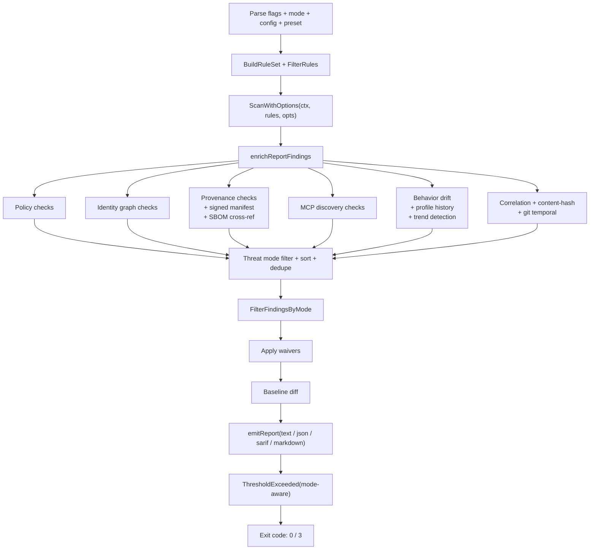

# cli

> CLI entry point: subcommand dispatch, flag parsing, scan orchestration, and daemon/MCP wiring.

## Responsibility

`cmd/skeptic/` is the `package main` entry point. It owns subcommand routing, CLI flag registration, the default scan pipeline orchestration (`performSkepticRun`), and thin wrappers that wire internal packages together for `serve`, `mcp`, `bundle`, `verify-bundle`, and `export-evidence` subcommands.

This is not an importable library — the "API" is the CLI itself.

**`scan`:** `--sarif-base-path` controls the repository base for SARIF artifact URIs; it defaults to the detected git root and falls back to CWD.

**`waive`:** Create SHA256-pinned waivers with accepted finding identities. Flags: `--path`, `--file`, `--rule`, `--reason`, `--out`, `--config`. At least one of `--file` or `--rule` is required; `--reason` is always required.

## Source Files

| File | Role |
|------|------|
| `main.go` | `main()`, `run()` subcommand dispatch, global flag extraction, version output, usage banner |
| `perform_skeptic_run.go` | Default scan path: flag registration (including `--mode`), mode/config/preset merge, post-scan enrichment |
| `profiling.go` | CPU/mem/trace profiling: `profileOptions`, `startProfiling`, `globalProfileAndStop` |
| `cli_helpers.go` | Shared CLI utilities: `parseOutputFormat`, `parsePolicyLevel`, `emitReport`, `skepticToolVersion`, `mergeGlobalFlagsIntoArgs`, `resolveScanRoots`, `canonicalizePaths` |
| `serve_cmd.go` | `serve` subcommand wiring: `runServeGlobal`, `executeDaemonScanForServe` |
| `mcp.go` | `mcp` subcommand → `internal/mcp.RunMCP` with scan/ingest/rules callbacks |
| `bundle_cmd.go` | `bundle` / `verify-bundle` → `internal/report` |
| `export_evidence_cmd.go` | `export-evidence` → `internal/report` |
| `waive_cmd.go` | `waive` → `internal/suppress.RunWaive` |
| `corpus_cmd.go` | `corpus` subcommand dispatch (init/fetch/info/scan/purge/\<SHA\> show/metadata) |

## Subcommand Dispatch

| Subcommand | Handler | Target Package |
|------------|---------|----------------|
| (default) | `performSkepticRun` | `internal/scan`, `internal/rules`, `internal/checks`, `internal/correlation`, ... |
| `ingest` | `ingest.RunIngest` | `internal/ingest` |
| `sign-rulepack` | `rules.RunSignRulepack` | `internal/rules` |
| `gen-rule-keypair` | `rules.RunGenRulepackKeypair` | `internal/rules` |
| `serve` / `daemon` | `runServeGlobal` → `daemon.RunServe` | `internal/daemon` |
| `mcp` | `runMCP` → `mcp.RunMCP` | `internal/mcp` |
| `init` / `init-config` | `configpkg.RunInit` | `internal/config` |
| `config` (`show`, `use`) | `configpkg.RunConfig` | `internal/config` |
| `waive` | `runWaive` | `internal/suppress` (`RunWaive`) |
| `version` | `runVersion` | local |
| `export-evidence` | `runExportEvidence` | `internal/report` |
| `bundle` | `runBundle` | `internal/report` |
| `verify-bundle` | `runVerifyBundle` | `internal/report` |
| `verify-rulepack` | `rules.RunVerifyRulepack` | `internal/rules` |
| `corpus` | `runCorpusGlobal` → dispatch to init/fetch/info/scan/purge/\<SHA\> show/metadata | `internal/corpus` |
| `scan` | `performSkepticRun` (explicit subcommand alias) | `internal/scan`, `internal/rules`, ... |
| `completion` | `completion.RunCompletion` | `internal/completion` |

## Default Scan Pipeline (`performSkepticRun`)



## Exit Codes

| Code | Meaning |
|------|---------|
| 0 | Success (or `--help`) |
| 1 | Runtime/scan/rules error |
| 2 | Invalid CLI arguments |
| 3 | Findings met or exceeded `--fail-on` severity or `--fail-on-score` threshold, AND the finding's rule family is gate-eligible for the active `--mode` (see `model.IsGateEligible`) |

## Dependencies

All `internal/` packages are imported here — this is the integration point that wires everything together.

## Test Surface

| File | Tests |
|------|-------|
| `main_helpers_test.go` | Format/policy parsing, path canonicalization, scan root resolution, global flag extraction/merging, hex prefix detection, positional arg handling |
| `cli_test.go` | Validation errors, JSON/SARIF output, subcommand dispatch, corpus scan validation |
| `policy_level_test.go` | Version subcommand |
| `config_test.go` | Config auto-load, preset CI defaults |
| `bench_test.go` | Rule compilation, scan, decode layers, ingest parsers, correlation, edit distance, feed format |
| `proof_corpus_test.go` | Proof corpus trust-audit validation across all rule families with `BuildTrustAssessment` verdict assertions |
| `rulepack_corpus_test.go` | Rule-pack JSON under `rulepacks/campaigns/` — signature verification and `RunRulePackTests` |
| `integration_daemon_test.go` | (build tag `integration`) MCP/daemon E2E, concurrent daemon scans |
| `integration_scan_test.go` | (build tag `integration`) Small corpus, decoders, provenance, correlation |
| `integration_perf_test.go` | (build tag `integration`) Incremental cache, worker scaling, large corpus, incremental stress |
| `integration_pipeline_test.go` | (build tag `integration`) Full pipeline, concurrent scan safety, rule filtering, path ignore, waivers, config lifecycle |
| `integration_corpus_test.go` | (build tag `integration`) Corpus lifecycle, duplicate init, non-markdown fetch |
| `integration_helpers_test.go` | (build tag `integration`) Shared helpers: daemon/MCP setup, corpus generation, polling utilities |

```bash
go test ./cmd/skeptic -count=1              # unit tests
go test -tags=integration ./cmd/skeptic     # integration tests
go test -bench=. ./cmd/skeptic              # benchmarks
```

## Related Docs

- [ARCHITECTURE.md](../ARCHITECTURE.md) — module layout and alias layer
- [CONFIGURATION.md](../CONFIGURATION.md) — all CLI flags and config keys
- [README.md](../../README.md) — CLI reference and workflow examples
- Every module doc — `cmd/skeptic` imports and wires all of them
