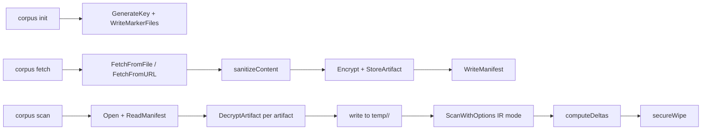

# corpus

> Encrypted-at-rest storage and scan isolation for curated agentic poisoning samples.

## Responsibility

The corpus package manages the lifecycle of a curated collection of potentially malicious `.md` files (SKILL.md, AGENTS.md) used to validate skeptic's AGT-\* rule detection. It handles initialization, encrypted storage, content validation, manifest integrity, path safety, and isolated scanning with expected-detection delta reporting.

## Public API

| Symbol | Signature | Description |
|--------|-----------|-------------|
| `Init` | `func Init(rawPath string, configValues map[string]string, scanTargets, mcpRoots []string) (string, error)` | Create corpus directory with key, markers, and empty manifest |
| `Open` | `func Open(rawPath string, configValues map[string]string) (*Corpus, error)` | Load existing corpus from disk |
| `Purge` | `func Purge(rawPath string, configValues map[string]string, confirm bool) error` | Remove corpus directory (requires confirm) |
| `ScanCorpus` | `func ScanCorpus(ctx context.Context, opts ScanOptions) (ScanResult, error)` | Decrypt, scan with isolated options, report deltas |
| `GenerateKey` | `func GenerateKey() ([]byte, error)` | 32-byte AES-256 key via crypto/rand |
| `Encrypt` | `func Encrypt(key, plaintext []byte) ([]byte, error)` | AES-256-GCM encrypt (nonce \|\| ciphertext \|\| tag) |
| `Decrypt` | `func Decrypt(key, ciphertext []byte) ([]byte, error)` | AES-256-GCM decrypt with tag verification |
| `LoadKey` / `WriteKey` | `func LoadKey(path string) ([]byte, error)` | Read/write 32-byte key file (mode 0600) |
| `FetchFromFile` | `func FetchFromFile(path string) ([]byte, string, []string, error)` | Validate, sanitize, and read local .md file |
| `FetchFromURL` | `func FetchFromURL(ctx context.Context, rawURL string, opts FetchOptions) ([]byte, string, []string, error)` | Fetch .md from URL with host allowlisting |
| `ValidateCorpusPath` | `func ValidateCorpusPath(resolved string, scanTargets, mcpRoots []string) error` | Reject git worktrees, MCP roots, vendor paths, scan targets |
| `UserDataDir` | `func UserDataDir() (string, error)` | XDG data directory (not cache) |
| `NewManifest` | `func NewManifest() Manifest` | Creates a new empty manifest with version and creation timestamp |
| `ReadManifest` / `WriteManifest` | `func ReadManifest(path string) (Manifest, error)` | Read/write corpus.lock with SHA256 self-integrity |
| `VerifyManifestIntegrity` | `func VerifyManifestIntegrity(rawData []byte, expectedHash string) error` | Validates manifest JSON against its `corpus_sha256` field |
| `FilterArtifacts` | `func FilterArtifacts(artifacts []Artifact, f ArtifactFilter) []Artifact` | Filter artifacts by source type, name, rule, or source (AND logic) |
| `SortArtifacts` | `func SortArtifacts(artifacts []Artifact, key string)` | Sort in place by name, size, date, or source-type; prefix `-` for descending |
| `Paginate` | `func Paginate(artifacts []Artifact, offset, limit int) []Artifact` | Slice for offset/limit pagination |
| `ResolveCorpusPath` | `func ResolveCorpusPath(flagPath string, configValues map[string]string) (string, error)` | Resolves corpus path from flag, config, or XDG default |
| `DefaultCorpusPath` | `func DefaultCorpusPath() (string, error)` | Returns the XDG-based default corpus directory path |
| `ResolvePath` | `func ResolvePath(path string) (string, error)` | Resolves symlinks and returns absolute path |
| `WriteMarkerFiles` | `func WriteMarkerFiles(corpusRoot string) error` | Writes `.gitignore` and `.skeptic-ignore` markers into the corpus root |
| `AcquireFlock` | `func AcquireFlock(path string) (*os.File, error)` | Acquires an exclusive file lock for concurrent access safety |
| `ReleaseFlock` | `func ReleaseFlock(f *os.File)` | Releases a previously acquired file lock |
| `TimestampMetadata` | `func TimestampMetadata(entry string) string` | Creates an ISO8601 timestamped metadata annotation |
| `SHA256Hex` | `func SHA256Hex(data []byte) string` | Returns the hex-encoded SHA256 hash of data |

### Key Types

| Type | Description |
|------|-------------|
| `Corpus` | Open corpus handle: root path, loaded key, manifest |
| `Manifest` | Top-level corpus.lock: version, created, integrity hash, artifacts |
| `Artifact` | Single encrypted .md: ID, original name, source, hashes, expected rules |
| `ScanResult` | Scan report plus per-artifact detection deltas |
| `ArtifactDelta` | Expected vs actual rule detections for one artifact |
| `FetchOptions` | Allowed hosts, HTTP policy, expected rules, max bytes |
| `ScanFunc` | Callback type: `func(ctx, rules, opts) (Report, error)` — injected scan engine for isolation |
| `ScanOptions` | Corpus path, config, format, output, timeout, artifact filter |
| `ArtifactFilter` | Filter criteria for `FilterArtifacts`: source type, name, rule, source (all case-insensitive) |

## Internal Design

### Crypto

AES-256-GCM with 12-byte random nonce prepended to ciphertext. Key generated via `crypto/rand`, stored in `.corpus-key` (mode 0600). Each artifact gets a unique nonce. GCM authentication tag provides tamper detection.

### Path Safety

`ValidateCorpusPath` runs four checks on the `filepath.Abs` + `filepath.EvalSymlinks` resolved path:
1. Walk ancestors for `.git/` (git worktree)
2. Prefix-match against MCP allowed roots
3. Check path components against forbidden set (node\_modules, vendor, venv, etc.)
4. Prefix-match against scan targets (bidirectional)

### Manifest Integrity

`corpus.lock` includes a `corpus_sha256` field computed over the JSON with that field zeroed. Verified at read time. Tampered manifests are rejected before any decryption.

### Scan Isolation

`ScanCorpus` decrypts artifacts to namespaced temp subdirectories (`<artifact-id>/<original-name>`), runs `scan.ScanWithOptions` in IR mode with all enrichment disabled, attributes findings back to artifacts by path prefix, computes expected-vs-actual deltas, then securely wipes the temp directory.

## Dependencies

```
internal/corpus -> internal/model      (Finding, Rule, Report, ScanOptions, ScanMode, etc.)
internal/corpus -> internal/security   (SHA256FileHex for encrypted artifact hash verification)
internal/corpus -> internal/scan       (ScanWithOptions, DefaultMaxBytes)
internal/corpus -> internal/rules      (DefaultRules for corpus scan)
internal/corpus -> internal/logging    (NewLogger for scan isolation)
```

## Data Flow



## Test Surface

| File | Coverage |
|------|----------|
| `internal/corpus/corpus_test.go` | Crypto round-trip, tamper detection, key I/O, init structure, path validation (git/MCP/vendor/scan-target/symlink), XDG data dir, config override, fetch validation, sanitization, manifest integrity, concurrent lock, namespaced dirs, duplicate filenames, hash verification, purge confirm, filter by source-type/name/rule/source/AND/no-match/empty, sort by name/size/date/source-type ascending and descending, pagination edge cases |
| `cmd/skeptic/integration_corpus_test.go` | Full lifecycle (init/fetch/info/scan/purge), duplicate init rejection, non-markdown fetch rejection |

## Related Docs

- [CORPUS.md](../CORPUS.md) -- user-facing reference
- [ARCHITECTURE.md](../ARCHITECTURE.md) -- module boundaries and dependency graph
- [CONFIGURATION.md](../CONFIGURATION.md) -- `corpus-path` config field
