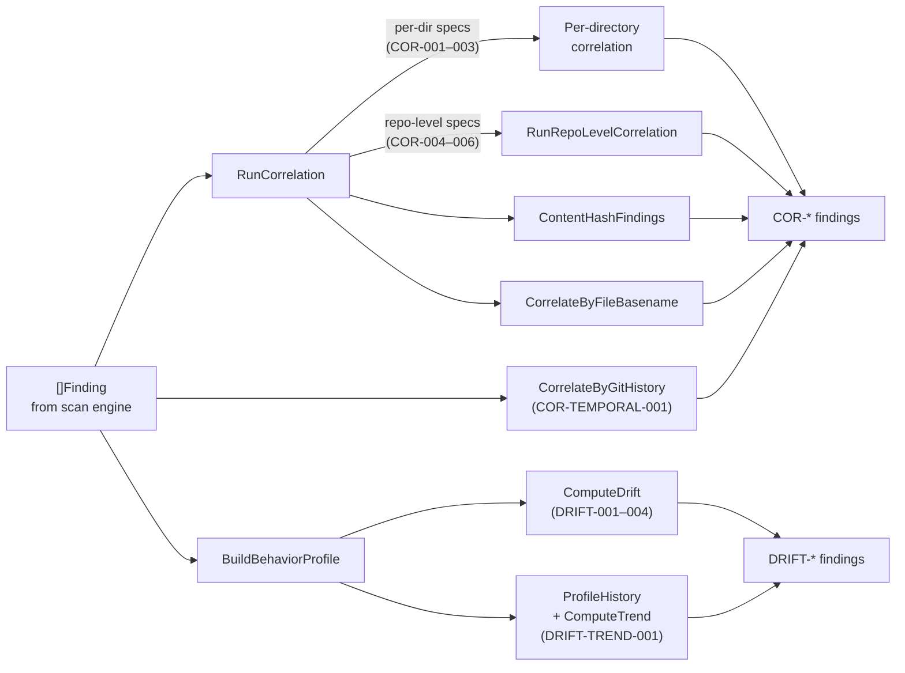

# correlation

> Cross-finding correlation, content-hash grouping, and behavior drift detection.

## Responsibility

`internal/correlation` looks across the full findings set after scanning to detect multi-finding attack patterns, repeated payloads across files, and behavioral drift between scan runs. It emits `COR-*` and `DRIFT-*` findings that link lower-confidence individual detections into higher-confidence composite signals. All findings from this package are assigned `ConfidenceClass: correlated`.

## Public API

### Correlation

| Symbol | Signature | Description |
|--------|-----------|-------------|
| `RunCorrelation` | `(findings []model.Finding) []model.Finding` | Multi-finding attack pattern detection grouped by directory scope, plus repo-level correlation for cross-directory patterns. |
| `RunRepoLevelCorrelation` | `(findings []model.Finding, specs []CorrelationSpec) []model.Finding` | Repo-wide correlation for patterns that span directories (COR-004, COR-005). |
| `ContentHashFindings` | `(findings []model.Finding) []model.Finding` | `COR-PAYLOAD-001` when identical match text appears in 3+ distinct files. |
| `CorrelateByFileBasename` | `(findings []model.Finding) []model.Finding` | `COR-FILE-001` when many distinct rule families hit the same file basename. |
| `DefaultCorrelationSpecs` | `var []CorrelationSpec` | Built-in per-directory cross-finding pattern definitions (COR-001 through COR-003). |
| `RepoLevelCorrelationSpecs` | `var []CorrelationSpec` | Repo-wide correlation specs: COR-004 requires `AGT-SKL-` and `ATK-PER-` (skill poisoning + persistence); COR-005 requires `(CLOUD-ID-|MID-|GRAPH-)` and `(AGT-MCP-|DISC-MCP-)` (cloud identity + MCP surface); COR-006 requires `CI-DEPBOT-001` and `(SCM-PKG-003|DEP-004|RUGPULL-003)` (dependency bot + install hooks). |
| `CorrelateByGitHistory` | `(findings []model.Finding, repoRoot string) []model.Finding` | Temporal correlation via `git log`: detects clusters of high-severity changes by a single author within 48h (COR-TEMPORAL-001). |

### Drift Detection

| Symbol | Signature | Description |
|--------|-----------|-------------|
| `BuildBehaviorProfile` | `(findings []model.Finding, totalFiles int) BehaviorProfile` | Snapshot of scan behavior for drift comparison. |
| `ComputeDrift` | `(current, previous BehaviorProfile, cfg DriftConfig) DriftReport` | Detects new/disappeared chains, severity shifts, and policy ID drift (DRIFT-004). |
| `DriftToFindings` | `(dr DriftReport) []model.Finding` | Converts drift report into `DRIFT-001` (new chains), `DRIFT-002` (disappeared chains), `DRIFT-003` (severity shift), `DRIFT-004` (new policy violations). |
| `SaveBehaviorProfile` | `(path string, profile BehaviorProfile) error` | Writes behavior profile to disk as JSON. |
| `LoadBehaviorProfile` | `(path string) (BehaviorProfile, error)` | Reads behavior profile from disk. |
| `DefaultDriftConfig` | `() DriftConfig` | Returns default drift detection thresholds. |
| `LoadProfileHistory` | `(path string) (ProfileHistory, error)` | Reads profile history from disk. |
| `SaveProfileHistory` | `(path string, h ProfileHistory) error` | Writes profile history to disk. |
| `(*ProfileHistory).ComputeTrend` | `() []model.Finding` | Monotonic severity trend detection across 3+ profiles. |

### Helpers

| Symbol | Signature | Description |
|--------|-----------|-------------|
| `GroupFindingsByDir` | `(findings []model.Finding) map[string][]model.Finding` | Directory-scoped grouping for correlation. |
| `RuleFamilyPrefix` | `(ruleID string) string` | Extracts rule family from ID (e.g., `TPCP-ACT` from `TPCP-ACT-001`). |
| `ExtractRuleIDs` | `(findings []model.Finding) []string` | Collects unique rule IDs from a findings slice. |
| `MatchesAllPatterns` | `(ruleIDs, patterns []string) bool` | Tests whether a rule set contains at least one match for every pattern. |
| `MatchingRuleIDs` | `(ruleIDs, patterns []string) []string` | Returns rule IDs that match any of the given patterns. |
| `CachedRegexp` | `(pattern string) *regexp.Regexp` | Thread-safe compiled regex cache for correlation pattern matching. |

## Dependencies

| Package | Why |
|---------|-----|
| `internal/model` | `Finding` type |

## Data Flow



## Test Surface

| File | Tests |
|------|-------|
| `correlation_test.go` | Correlation specs (COR-001–003), repo-level correlation (COR-004, COR-005, COR-006), content-hash grouping, file-basename correlation |
| `drift_test.go` | Profile building, drift computation (including DRIFT-004 policy drift), save/load, trend detection |
| `temporal_test.go` | `isHighSeverityFinding`, empty findings, non-repo graceful return, git-not-in-PATH handling |

```bash
go test ./internal/correlation -count=1
```

## Related Docs

- [scan module](scan.md) — calls correlation after scan completion
- [ARCHITECTURE.md](../ARCHITECTURE.md) — correlation in dependency graph
- [CONFIGURATION.md](../CONFIGURATION.md) — `--behavior-history`, `--drift-severity-multiplier`, `--drift-allowed-chains`, `--git-correlation` flags
