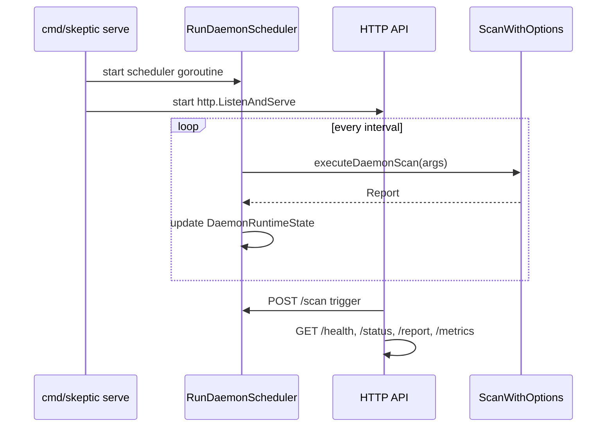

# daemon

> HTTP daemon with scheduled scans, filesystem watch, health/status/report/metrics endpoints, and graceful shutdown.

## Responsibility

`internal/daemon` provides the `skeptic serve` persistent scanning mode. It runs scheduled scans on a configurable interval, exposes a local HTTP API for health/status/report/metrics queries and manual scan triggers, supports optional filesystem-watch polling, and handles graceful shutdown with scheduler coordination. It also provides `DaemonAPIClient` for loopback-only HTTP communication used by the MCP bridge.

## Public API

### Server Lifecycle

| Symbol | Signature | Description |
|--------|-----------|-------------|
| `RunServe` | `(ctx context.Context, serveArgs []string, stdout, stderr io.Writer, deps DaemonDeps) int` | Starts daemon API and background scheduler. |
| `ParseServeFlags` | `(serveArgs []string, stderr io.Writer) (DaemonConfig, error)` | Parses `skeptic serve` flags. |
| `SetupDaemonRoutes` | `(mux, authToken, allowUnauth, state, triggerCh, bindAddr, interval)` | Registers HTTP handlers. |
| `RunDaemonScheduler` | `(ctx, triggerCh, cfg, logger, state, deps)` | Serializes scan triggers; one scan at a time. |
| `AwaitShutdownSignal` | `(ctx, server, pprofServer, serverErrCh, cancelScheduler, schedulerDoneCh, logger) int` | Blocks until signal/cancel, then graceful shutdown. |
| `RunFSWatchPoller` | `(ctx, triggerCh, paths, debounce, logger)` | Filesystem mtime polling with debounce. |

### Configuration Types

| Type | Description |
|------|-------------|
| `ScanFunc` | Callback type: `func(ctx, rules, opts) (Report, error)` — avoids import cycle with `cmd/skeptic`. |
| `DaemonDeps` | Scan execution callbacks, global flag overrides, and system config for the daemon. |
| `DaemonConfig` | Resolved daemon settings after flag parsing; tracks `visitedFlags` for precedence. |
| `GlobalFlagOverrides` | Global CLI flags (verbosity, quiet, config, log-file) forwarded from the dispatcher. |
| `SystemDaemonConfig` | System config subset (daemon-bind, daemon-token-dir) populated by the CLI layer. |
| `DaemonStatus` | Immutable status snapshot for HTTP clients. |
| `DaemonRuntimeState` | Synchronized mutable scheduler state with `BeginRun`, `EndRun`, `Status`, `Report`, `WriteMetrics`, `SetNextRun`. |

### Client

| Symbol | Signature | Description |
|--------|-----------|-------------|
| `NewDaemonAPIClient` | `(baseURL, token string, allowRemote bool) (*DaemonAPIClient, error)` | Validates loopback safety, builds bounded HTTP client. |
| `EnsureLoopbackURL` | `(parsed *url.URL) error` | Enforces local-only daemon control. |
| `(*DaemonAPIClient).RequestJSON` | `(ctx, method, endpoint string, payload) (map[string]any, error)` | Authenticated daemon API calls with bounded response. |

## Dependencies

| Package | Why |
|---------|-----|
| `internal/model` | `Report`, `ScanOptions`, `Rule` types |
| `internal/config` | `PrintFormattedFlags` for `--help` output |
| `internal/logging` | Structured logger |

## Data Flow



## Test Surface

| File | Tests |
|------|-------|
| `daemon_test.go` | Handler tests, metrics, concurrent state access, scheduler cancellation, backpressure, method enforcement |
| `serve_test.go` | Flag parsing, interval resolution, auth, token generation, state methods, dry-run, global flag application, system config application, daemon scan arg building |

```bash
go test ./internal/daemon -count=1
```

## Related Docs

- [SERVER.md](../SERVER.md) — security model and daemon/MCP reference
- [mcp module](mcp.md) — MCP bridge uses `DaemonAPIClient` for loopback API calls
- [CONFIGURATION.md](../CONFIGURATION.md) — `--scan-interval`, `--run-on-start`, `--auth-token-file`
- [RUNTIME_SAFETY.md](../RUNTIME_SAFETY.md) — deployment guidance for daemon mode
