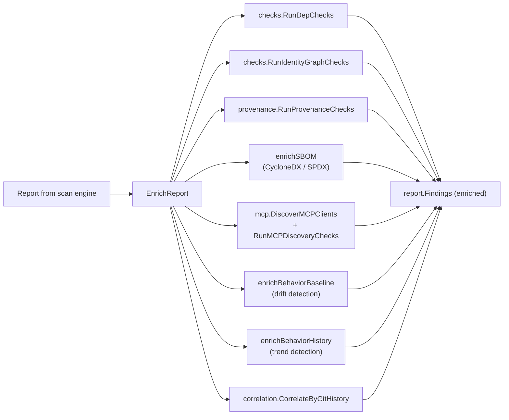

# enrich

> Post-scan enrichment pipeline that augments the scan report with dependency checks, identity graph analysis, provenance verification, SBOM cross-referencing, MCP discovery, behavior drift detection, and git-history correlation.

## Responsibility

`internal/enrich` owns the orchestration of all enrichment steps that run **after** the core scan engine returns its initial `Report`. It receives a mutable `*model.Report` and appends findings from each enabled enrichment pass. The package exists to decouple post-scan analysis from the scan engine itself, keeping `internal/scan` focused on file-level detection while `enrich` handles cross-cutting, repo-level, and external-data enrichment.

## Public API

| Symbol | Signature | Description |
|--------|-----------|-------------|
| `Options` | `struct` | Controls which enrichment steps run; carries paths for provenance manifests, SBOMs, behavior baselines, and history files |
| `EnrichReport` | `func(report *model.Report, opts Options, roots []string, threatMode model.ThreatMode, logger *logging.Logger)` | Runs all enabled enrichment steps, appending findings to `report.Findings` in-place |

### `Options` fields

| Field | Type | Purpose |
|-------|------|---------|
| `PolicyChecks` | `bool` | Enable dependency/lockfile analysis via `checks.RunDepChecks` (npm/PyPI manifest checks, typosquat detection) |
| `IdentityGraphHops` | `int` | BFS depth for IAM/RBAC/OIDC identity graph traversal |
| `RedactSecrets` | `bool` | Pass-through to enrichment checks for match sanitization |
| `ProvenanceManifestPath` | `string` | Path to provenance manifest for hash verification |
| `RequireSignedProvenanceManifest` | `bool` | Require Ed25519 signature on the manifest |
| `SBOMPath` | `string` | Path to CycloneDX or SPDX SBOM for cross-referencing |
| `AutoDiscoverMCP` | `bool` | Scan for MCP client configs and run discovery checks |
| `BehaviorBaselinePath` | `string` | Path to behavior profile for drift detection |
| `DriftSeverityMultiplier` | `float64` | Scaling factor for drift-induced severity shifts |
| `DriftAllowedChainsRaw` | `string` | Comma-separated chain IDs exempt from drift alerts |
| `BehaviorHistoryPath` | `string` | Path to multi-snapshot profile history for trend detection |
| `GitCorrelation` | `bool` | Enable git-author/time correlation via `correlation.CorrelateByGitHistory` |

## Internal Design

`EnrichReport` runs enrichment steps sequentially in a fixed order:

1. **Dependency checks** (`checks.RunDepChecks`) — gated by `PolicyChecks`
2. **Identity graph** (`checks.RunIdentityGraphChecks`) — gated by `ThreatMode` (runs for `all` and `machine-identity`, skipped for `ai-workload`)
3. **Provenance verification** (`provenance.RunProvenanceChecks`) — gated by non-empty `ProvenanceManifestPath`
4. **SBOM cross-reference** (`enrichSBOM`) — parses CycloneDX or SPDX, extracts package hashes from discovered manifests, cross-references
5. **MCP discovery** (`mcp.DiscoverMCPClients` + `mcp.RunMCPDiscoveryChecks`) — gated by `AutoDiscoverMCP`
6. **Behavior drift** (`enrichBehaviorBaseline`) — loads previous profile, computes drift, saves current profile
7. **Behavior trend** (`enrichBehaviorHistory`) — loads multi-snapshot history, pushes current, computes trend findings
8. **Git correlation** (`correlation.CorrelateByGitHistory`) — gated by `GitCorrelation`

Each step appends directly to `report.Findings`. Steps that fail to load external data (SBOM, behavior files) log warnings and continue without error.

## Dependencies

| Package | Why |
|---------|-----|
| `internal/checks` | Dependency checks, identity graph analysis, manifest discovery |
| `internal/correlation` | Behavior profiles, drift computation, trend detection, git-history correlation |
| `internal/logging` | Structured logging for warnings during enrichment |
| `internal/mcp` | MCP client config discovery and security checks |
| `internal/model` | `Report`, `Finding`, `ThreatMode` types |
| `internal/provenance` | Provenance hash verification, SBOM parsing, cross-referencing |

## Data Flow

## Test Surface

| File | Coverage |
|------|----------|
| `enrich_test.go` | No-op enrichment (all options disabled), policy checks on empty dir, identity graph threat-mode gating, git correlation on non-git dir, `Options` field coverage |

Run: `go test ./internal/enrich/ -v`

## Related Docs

- [ARCHITECTURE.md](../ARCHITECTURE.md) — full CLI pipeline showing `enrichReportFindings` step
- [checks.md](checks.md) — dependency checks, identity graph, manifest discovery
- [correlation.md](correlation.md) — behavior profiles, drift, trend, git correlation
- [provenance.md](provenance.md) — hash verification, SBOM parsing
- [mcp.md](mcp.md) — MCP discovery checks
- [cli.md](cli.md) — `performSkepticRun` wiring that calls `EnrichReport`
