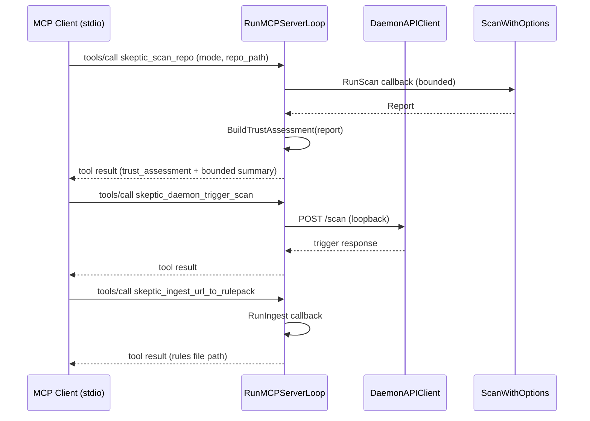

# mcp

> Local MCP JSON-RPC server for agentic workflows: scan, ingest, daemon bridge, and auto-discovery.

## Responsibility

`internal/mcp` implements the `skeptic mcp` subcommand — a stdio-based JSON-RPC server that bridges agentic clients (Cursor, Claude Desktop, etc.) to skeptic's scanning and ingestion capabilities. It enforces loopback-only daemon communication, tool allowlisting, trigger cooldowns, ingest approval gates, and audit logging. It also provides MCP client auto-discovery across 10 platforms and optional auto-daemon lifecycle management.

The package is split across five files for modularity:
- `mcp.go` — core protocol, state, framing, request dispatch
- `mcp_tools.go` — tool descriptors, tool dispatch, scan/daemon tool implementations
- `mcp_ingest.go` — ingest-specific tool logic and approval gate
- `mcp_auto_daemon.go` — child daemon process lifecycle (start/stop)
- `discovery.go` — MCP client config discovery across 10 platforms

## Public API

### Server

| Symbol | Signature | Description |
|--------|-----------|-------------|
| `RunMCP` | `(ctx, args, stdout, stderr, opts Options) int` | Starts MCP stdio server with parsed flags. |
| `RunMCPServerLoop` | `(ctx, input, output, state) int` | Framed JSON-RPC message loop. |
| `HandleMCPRequest` | `(req MCPRequest, state) (MCPResponse, bool)` | Routes MCP methods (`initialize`, `tools/list`, `tools/call`, `resources/*`). |
| `MCPToolDescriptors` | `(allowTrigger, allowIngest, requireApproval bool) []map[string]any` | Available tool definitions for this session. |

### Tools

| Symbol | Signature | Description |
|--------|-----------|-------------|
| `MCPScanRepo` | `(ctx, args, state) (map[string]any, error)` | Bounded repository scan with mode-aware trust assessment. Accepts `mode` parameter; returns `trust_assessment`, `findings_by_confidence`, and bounded summary. |
| `BuildTrustAssessment` | `(report model.Report) map[string]any` | Generates structured trust assessment: `verdict` (`action_required` / `review_advised` / `no_issues_found`), counts by confidence class, `risk_areas` by category, and `review_priority` files ranked by wedge relevance. |
| `MCPIngestURLToRulepack` | `(ctx, args, rulesOutDir, runIngest) (map[string]any, error)` | URL-to-rulepack ingestion with safe defaults. |
| `HandleMCPToolsCall` | `(paramsRaw, state) (map[string]any, error)` | Tool dispatch with strict argument handling. |

### MCP tools (`tools/list`)

| Tool | Description | Key parameters |
|------|-------------|----------------|
| `skeptic_daemon_health` | Daemon liveness check | — |
| `skeptic_daemon_status` | Daemon runtime state | — |
| `skeptic_daemon_report` | Latest scan report | — |
| `skeptic_daemon_metrics` | Prometheus-format metrics | — |
| `skeptic_scan_repo` | Bounded repository scan | `repo_path` (required), `mode`, `preset`, `profile`, `scan_style`, `threat_mode`, `fail_on`, `include_rules`, `exclude_rules`, `incremental`, `baseline`, `diff_only`, `workers`, `max_files`, `max_findings`, `sample_limit`, `require_git` |
| `skeptic_waive` | Create SHA256-pinned waivers | `repo_path` (required), `reason` (required), `file`, `rule` |
| `skeptic_daemon_trigger_scan` | Trigger daemon scan (if `--allow-trigger`) | `reason` |
| `skeptic_ingest_url_to_rulepack` | Ingest URL to rulepack (if `--allow-ingest`) | `source_url` (required), `out_file`, `allow_host`, `ecosystems`, `min_severity`, `rule_quality`, `allow_http` |
| `skeptic_approve_ingest` | Approve pending ingest (if `--require-ingest-approval`) | — |

`tools/call` for `skeptic_waive` invokes `suppress.RunWaive` with a `ScanFunc` adapter over `state.RunScan` (bounded JSON scan, then parse `model.Report`).

### Discovery

| Symbol | Signature | Description |
|--------|-----------|-------------|
| `DiscoverMCPClients` | `() []MCPClientConfig` | Probes filesystem for MCP client configs (10 platforms). |
| `RunMCPDiscoveryChecks` | `(configs []MCPClientConfig, redactSecrets bool) []model.Finding` | Flags risky MCP server definitions. |
| `CheckMCPServerEntry` | `(client, configPath string, srv MCPServerEntry, redactSecrets bool) []model.Finding` | Per-server risk analysis. |
| `MCPClientCandidates` | `(home string) []MCPCandidate` | Returns filesystem probe paths for all supported MCP client platforms. |
| `ParseMCPConfigServers` | `(data []byte) []MCPServerEntry` | Parses MCP server entries from a JSON config file. |

### Security and Path Helpers

| Symbol | Signature | Description |
|--------|-----------|-------------|
| `ResolveMCPAllowedScanRoots` | `(raw string) ([]string, error)` | Parses and resolves `--mcp-allowed-roots` into absolute paths. |
| `ParseMCPIngestAllowedHosts` | `(raw string) []string` | Parses `--mcp-ingest-allowed-hosts` into hostname list. |
| `CheckMCPIngestHostAllowed` | `(sourceURL string, allowed []string) error` | Validates ingest URL against allowed host list. |
| `PathUnderAllowedScanRoots` | `(resolved string, allowed []string) bool` | Tests whether a path falls under any allowed scan root. |
| `ResolveRulesOutputPath` | `(outFile, rulesOutDir string) (string, error)` | Resolves ingest output path for rule pack files. |
| `AnyToInt` | `(value any, fallback int) (int, error)` | Converts JSON-decoded numeric value to int. |

### Resources

| Symbol | Signature | Description |
|--------|-----------|-------------|
| `HandleMCPResourcesList` | `() map[string]any` | Returns available MCP resources for `resources/list`. |
| `HandleMCPResourcesRead` | `(params json.RawMessage, state *MCPServerState) (map[string]any, error)` | Reads MCP resources by URI for `resources/read`. |

**Resource URIs:** `skeptic://rules/builtin`, `skeptic://rules/external`, `skeptic://report/latest`, `skeptic://config/active`.

### Frame I/O

| Symbol | Signature | Description |
|--------|-----------|-------------|
| `ReadMCPFrame` | `(reader *bufio.Reader) ([]byte, error)` | Reads one newline-delimited JSON-RPC message. |
| `WriteMCPFrame` | `(writer *bufio.Writer, payload any) error` | Writes one newline-delimited JSON-RPC response. |

### Types

| Type | Description |
|------|-------------|
| `Options` | MCP server configuration: callbacks, flags, daemon config, allowed roots. |
| `MCPRequest` | Inbound JSON-RPC request envelope. |
| `MCPResponse` | Outbound JSON-RPC response envelope. |
| `MCPError` | JSON-RPC error object. |
| `MCPToolsCallParams` | Parsed `tools/call` parameters: tool name and arguments. |
| `MCPServerState` | Server state: options, audit log, cooldown tracking, pending approvals. |
| `PendingIngestRequest` | Ingest request awaiting user approval. |
| `MCPAuditEntry` | Audit log entry: timestamp, tool, result, duration. |
| `RunScanFunc` | Callback type for scan invocation: `func(ctx, args, stdout, stderr) int`. |
| `RunIngestFunc` | Callback type for ingest invocation: `func(ctx, args, stdout, stderr) int`. |
| `DefaultRulesFunc` | Callback type for rule loading: `func() []model.Rule`. |
| `MCPClientConfig` | Discovered MCP client configuration with path and servers. |
| `MCPServerEntry` | Single MCP server definition within a client config. |
| `MCPCandidate` | Filesystem candidate for MCP config discovery. |

## Dependencies

| Package | Why |
|---------|-----|
| `internal/model` | `Rule`, `Report`, `ScanOptions` types |
| `internal/daemon` | `DaemonAPIClient` for loopback HTTP communication |
| `internal/config` | Preset resolution for scan defaults |
| `internal/logging` | Logger |
| `internal/security` | Redaction for discovery findings |
| `internal/suppress` | `RunWaive` for `skeptic_waive` tool |

## Data Flow



## Test Surface

| File | Tests |
|------|-------|
| `mcp_test.go` | Loopback policy, frame round-trip, tool descriptors, scan/ingest validation, cooldown, approval gate, concurrency, timeout, connection drop, metrics, config resource |
| `discovery_test.go` | Config parsing, discovery checks, fixture-based discovery |
| `mcp_fuzz_test.go` | Fuzz: `MCPRequestParsing` |

```bash
go test ./internal/mcp -count=1
```

## Related Docs

- [SERVER.md](../SERVER.md) — daemon and MCP server reference, auto-daemon docs
- [daemon module](daemon.md) — `DaemonAPIClient` used by MCP for loopback communication
- [ingest module](ingest.md) — `RunIngest` wrapped by MCP ingest tool
- [README.md](../../README.md) — Cursor MCP config snippet
