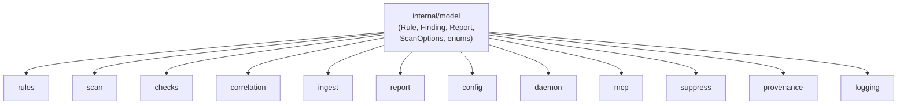

# model

> Shared domain types for the entire skeptic project.

## Responsibility

`internal/model` defines every data structure that crosses package boundaries: `Rule`, `Finding`, `Report`, `ScanOptions`, and the typed string enumerations (`Severity`, `ScanProfile`, `ScanStyle`, `ThreatMode`, etc.). It has zero intra-project dependencies and imports only the Go standard library, making it the leaf of the dependency graph that every other package can safely import.

## Public API

### Core Domain Types

| Type | Description |
|------|-------------|
| `Rule` | Detection rule: ID, metadata, regex pattern, optional `PathPattern`/`ContextPattern`/`ContextWindow` for narrowing, `LiteralHint` for pre-filter, `Remediation` for fix guidance, optional `ConfidenceClass` override. |
| `Finding` | Single detection result: rule reference, file/line/match, severity, `ConfidenceClass`, encoding chain, baseline state, `Suppressed` and optional `SuppressionReason` (waiver/suppression metadata), `Remediation`. |
| `Report` | Aggregated scan output: target paths, profile, findings, severity summary, `FindingsByConfidence`, `Mode`, baseline diff counters, threshold status, scan timing, `RiskScore` (0–100). |
| `ScanOptions` | Full scan configuration: paths, profile, style, threat mode, `Mode` (`ScanMode`), limits, incremental cache, rule filters, `NFKC`, `AhoCorasick`, `ToolName`, logger. |
| `RuleSpec` | JSON-serializable rule definition for external rule packs. |
| `RulePack` | JSON wrapper for versioned external rule collections with metadata. |

### Enumerations

| Type | Values |
|------|--------|
| `Severity` | `info`, `low`, `medium`, `high`, `critical`, `none` |
| `ConfidenceClass` | `definitive`, `heuristic`, `correlated` |
| `ScanMode` | `developer`, `ir`, `deep` |
| `ScanProfile` | `repo`, `developer`, `container`, `fullfs` |
| `ScanStyle` | `pattern`, `behavior`, `hybrid` |
| `ThreatMode` | `all`, `machine-identity`, `ai-workload` |
| `OutputFormat` | `text`, `json`, `sarif`, `markdown` |
| `RuleTarget` | `content`, `path` |
| `RuleQualityMode` | `off`, `warn`, `strict` |

### Interfaces

| Interface | Description |
|-----------|-------------|
| `CompiledPattern` | `MatchString(s string) bool` — abstraction over `*regexp.Regexp` for rule matching. |
| `ScanLogger` | `Errorf`, `Warnf`, `Infof`, `Debugf` — decouples scan options from the concrete `logging.Logger`. |

### Functions

| Symbol | Signature | Description |
|--------|-----------|-------------|
| `SeverityWeight` | `(s Severity) int` | Numeric rank for severity comparison. |
| `ParseSeverity` | `(raw string) (Severity, error)` | Validates severity string input. |
| `ParseProfile` | `(raw string) (ScanProfile, error)` | Validates profile string input. |
| `ParseScanStyle` | `(raw string) (ScanStyle, error)` | Validates scan style string input. |
| `ScanStyleUsesPattern` | `(style ScanStyle) bool` | True for `pattern` and `hybrid`. |
| `ScanStyleUsesBehavior` | `(style ScanStyle) bool` | True for `behavior` and `hybrid`. |
| `ParseThreatMode` | `(raw string) (ThreatMode, error)` | Validates threat mode string input. |
| `LooksLikeText` | `(data []byte) bool` | Heuristic: returns true if data appears to be text (not binary). Shared by `scan` and `ingest`. |
| `ExpandHomePath` | `(path string) string` | Resolves `~` to user home directory. |
| `CompactSnippet` | `(line string) string` | Normalizes line snippets to bounded report-friendly text. |
| `SortedMapKeys` | `(set map[string]struct{}) []string` | Sorted keys for deterministic iteration. |
| `ParseConfidenceClass` | `(raw string) (ConfidenceClass, error)` | Validates confidence class string input. |
| `DefaultConfidenceForRuleID` | `(ruleID string) ConfidenceClass` | Derives confidence from rule ID prefix (structural wedge → definitive, `COR-`/`DRIFT-` → correlated, else heuristic). |
| `ParseScanMode` | `(raw string) (ScanMode, error)` | Validates scan mode string; empty defaults to `developer`. |
| `IsGateEligible` | `(ruleID string, mode ScanMode) bool` | Reports whether a rule family can trigger build failure in the given mode. Only wedge families gate in `developer`; `ir`/`deep` are advisory. |
| `FilterFindingsByMode` | `(findings []Finding, mode ScanMode) []Finding` | Presentation filter: in `developer`, shows definitive + correlated at all severities, heuristic only at critical. `ir`/`deep` show all. |
| `SummarizeFindingsByConfidence` | `(findings []Finding) map[string]int` | Counts findings by confidence class. Skips findings with `Suppressed=true`. |

## Internal Design

The package is split across two files: `model.go` (types, enums, utility functions) and `filetypes.go` (text-detection heuristic shared by `scan` and `ingest`). All types use value semantics except `Rule.RE` and `Rule.PathPattern`/`ContextPattern` which are interface/pointer fields populated at compile time by `internal/rules`.

Threat-mode filtering (`FindingMatchesThreatMode`, `FilterFindingsByThreatMode`) lives in `internal/scan/filter.go`, not in this package.

### Confidence taxonomy

`ConfidenceClass` describes epistemic strength, not risk. Confidence defaults and developer-mode gate eligibility are declared together in the `ruleFamilies` table, so a family cannot present at full confidence while being unable to fail a build. `DefaultConfidenceForRuleID` resolves a rule ID against that table by longest matching prefix: structural wedge prefixes (`AGT-TRUST-`, `SCM-`, `GRAPH-`, `CLOUD-ID-`, `CI-PRT-`, `POL-GHA-`, etc.) → `definitive`; `COR-`/`DRIFT-` → `correlated`; everything else (including `AGT-SKL-`, `ATK-`, `BHV-`, `TPCP-IOC-`) → `heuristic`. Rules may override via the optional `Rule.ConfidenceClass` field. Confidence affects presentation and summarization; mode/family/severity affect blocking.

`RuleFamilies()` returns a copy of the table. Package tests enforce three invariants: prefixes are uppercase and dash-terminated, every declared prefix is emitted by some non-test source, and a definitive family either gates or records an `UngatedReason`.

### Operating modes

`ScanMode` (`developer`, `ir`, `deep`) sits above presets in config resolution. `IsGateEligible` limits which rule families can trigger exit-code failure in `developer` mode. `FilterFindingsByMode` is a presentation filter applied after correlation — in `developer`, heuristic findings below critical severity are hidden.

## Dependencies

None. `internal/model` imports only standard library packages (`fmt`, `os`, `regexp`, `sort`, `strings`).

## Data Flow



Every other `internal/` package imports `model`. No package imports `model` transitively through another internal package — all imports are direct.

## Test Surface

| File | Tests |
|------|-------|
| `model_test.go` | `TestParseSeverity`, `TestSeverityWeight`, `TestParseProfile`, `TestCompactSnippet`, `TestSortedMapKeys`, `TestExpandHomePath`, `TestParseScanStyle`, `TestParseThreatMode`, `TestDefaultConfidenceForRuleID`, `TestIsGateEligible`, `TestFilterFindingsByMode` |

```bash
go test ./internal/model -count=1
```

## Related Docs

- [ARCHITECTURE.md](../ARCHITECTURE.md) — dependency graph shows `model` as universal leaf
- Every other module doc — all import `model`
