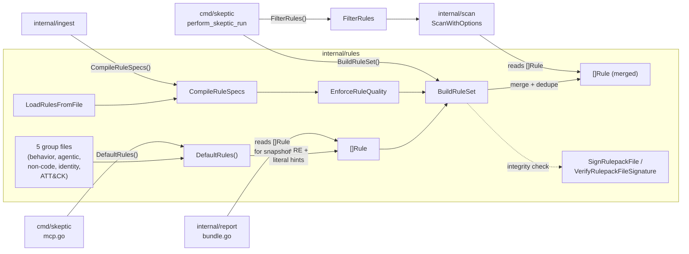

# rules

> Built-in detection library, external rule-pack loading, Ed25519 signing, and quality enforcement.

## Responsibility

`internal/rules` owns the built-in detection library and everything needed to extend it at runtime: loading external rule packs from JSON files or directories (including nested subdirectories), verifying their integrity via SHA256 hashes and Ed25519 detached signatures, enforcing quality gates on ingested rules, and deduplicating the final merged rule set. It also provides the `sign-rulepack`, `verify-rulepack`, and `gen-rule-keypair` CLI subcommands.

The package does **not** execute rules against files — that is `internal/scan`'s job. It produces a `[]model.Rule` slice that the scan engine and other consumers treat as read-only input.

## Public API

### Core Composition

| Symbol | Signature | Description |
|--------|-----------|-------------|
| `DefaultRules` | `() []Rule` | Returns the full built-in rule set with compiled regexes and literal hints. Single composition point that assembles all group functions in deterministic order. |
| `FilterRules` | `(rules []Rule, include, exclude []string) []Rule` | Applies `--include-rules` / `--exclude-rules` patterns (exact, glob, prefix) to narrow a rule set. |
| `RuleIDMatchesPattern` | `(id, pattern string) bool` | Tests whether a rule ID matches a pattern using exact, `filepath.Match` glob, or prefix semantics. |
| `DedupeRules` | `(in []Rule) []Rule` | Removes duplicate rules by `ID|Target|Pattern|Severity` composite key, preserving order. |

### Rule Pack Loading

| Symbol | Signature | Description |
|--------|-----------|-------------|
| `BuildRuleSet` | `(includeDefaults bool, defaultRules []Rule, rulesFileArg, rulesDir, rulesSHA256Arg, rulesPubKeyArg string, requireSignedRules bool, ruleQualityMode model.RuleQualityMode, logger *logging.Logger) ([]Rule, error)` | Merges built-in and external rules with full integrity, signature, and quality enforcement pipeline. Primary entry point for CLI rule assembly. |
| `CollectRuleFiles` | `(rulesFileArg, rulesDir string) ([]string, error)` | Resolves and deduplicates external rule-pack file paths from `--rules-file` and `--rules-dir`. For `--rules-dir`, walks the directory tree recursively, collecting `*.json` rule files while skipping detached signatures (`.json.sig`) and companion test packs (`*.test.*.json`). |
| `LoadRulesFromFile` | `(path string) ([]Rule, error)` | Parses a JSON file as either `RulePack` or bare `[]RuleSpec` and compiles regex patterns. |
| `CompileRuleSpecs` | `(specs []model.RuleSpec, path string) ([]Rule, error)` | Validates fields (ID, pattern, severity, target) and compiles each spec's RE2 regex. |
| `BuildRuleHashMap` | `(rulesFileArg, rulesSHA256Arg string) (map[string]string, error)` | Pairs `--rules-file` entries with expected SHA256 hashes for integrity verification. |

### Literal Hint Pre-filter

| Symbol | Signature | Description |
|--------|-----------|-------------|
| `ExtractLiteralHint` | `(pattern string) string` | Finds the longest case-insensitive literal substring that must appear for a regex to match. Used by the scan engine's Aho-Corasick pre-filter to skip files that cannot match any rule. |
| `ApplyLiteralHints` | `(rules []Rule)` | Populates `Rule.LiteralHint` from `Rule.Pattern` for all rules that lack one. |

### Signing and Verification

| Symbol | Signature | Description |
|--------|-----------|-------------|
| `RunSignRulepack` | `(args []string, stdout, stderr io.Writer) int` | CLI subcommand: signs a rule pack with a detached Ed25519 signature. |
| `RunGenRulepackKeypair` | `(args []string, stdout, stderr io.Writer) int` | CLI subcommand: generates an Ed25519 PKCS8/PKIX key pair in PEM form. |
| `SignRulepackFile` | `(rulepackPath, privateKeyPath, keyID string) (RulePackSignatureMetadata, error)` | Signs a rule-pack file's SHA256 hash with an Ed25519 private key. |
| `VerifyRulepackFileSignature` | `(rulepackPath string, signature RulePackSignatureMetadata, pubKeys []ed25519.PublicKey) error` | Validates version, algorithm, hash, and signature against trusted keys. |
| `VerifyMultiSig` | `(content []byte, sigs []RulePackSignature, policy MultiKeyPolicy) error` | Verifies t-of-n multi-key signature policy for rule packs. |
| `GenerateRulepackKeypair` | `() (privateDER, publicDER []byte, err error)` | Generates PKCS8/PKIX DER key material. |
| `LoadPublicKeys` | `(paths []string) ([]ed25519.PublicKey, error)` | Loads Ed25519 public keys from PEM files. |
| `LoadRulepackSignature` | `(path string) (RulePackSignatureMetadata, error)` | Parses detached signature JSON metadata from disk. |
| `WriteRulepackSignature` | `(path string, signature RulePackSignatureMetadata) error` | Writes detached signature JSON to disk. |
| `WritePEMFile` | `(path, blockType string, der []byte, mode os.FileMode) error` | Writes a single PEM block with controlled file permissions. |
| `DefaultRulepackSignaturePath` | `(rulepackPath string) string` | Returns `<rulepackPath>.sig`. |
| `RunVerifyRulepack` | `(args []string, stdout, stderr io.Writer) int` | CLI subcommand: verifies a rule pack's detached Ed25519 signature against trusted public keys. |
| `LoadEd25519PrivateKeyFromPEM` | `(path string) (ed25519.PrivateKey, error)` | Reads and parses an Ed25519 private key from a PEM file. |
| `LoadEd25519PublicKeyFromPEM` | `(path string) (ed25519.PublicKey, error)` | Reads and parses an Ed25519 public key from a PEM file. |
| `ParseEd25519PrivateKeyPEM` | `(data []byte) (ed25519.PrivateKey, error)` | Parses raw PEM bytes into an Ed25519 private key. |
| `ParseEd25519PublicKeyPEM` | `(data []byte) (ed25519.PublicKey, error)` | Parses raw PEM bytes into an Ed25519 public key. |
| `RulepackSignatureMessage` | `(fileSHA256 string) []byte` | Creates domain-separated signing message bytes. |

### Quality Enforcement

| Symbol | Signature | Description |
|--------|-----------|-------------|
| `ParseRuleQualityMode` | `(raw string) (model.RuleQualityMode, error)` | Validates `off|warn|strict` mode string. |
| `ValidateRuleSpecQuality` | `(spec model.RuleSpec) []RuleQualityIssue` | Returns analyst-facing issues for one rule spec (ID format, title/description length, pattern breadth, MITRE format). |
| `EnforceRuleQualityForSpecs` | `(specs []model.RuleSpec, source string, mode model.RuleQualityMode, logger *logging.Logger) error` | Applies warn/strict quality enforcement to externally loaded specs. In strict mode, any issue is a hard error. |

### Types

| Symbol | Description |
|--------|-------------|
| `Rule` | Type alias for `model.Rule` (convenience for struct literals in group files). Includes optional `ExcludePattern` (`*regexp.Regexp`): when set, a content match is dropped if the matched line also matches this pattern (line-level false-positive suppression; evaluated in `internal/scan`). |
| `RulePackSignatureMetadata` | On-disk JSON structure for detached Ed25519 signatures (version, algorithm, key ID, SHA256, base64 signature). |
| `RulePackSignature` | In-memory representation of a single Ed25519 signature with optional key ID. |
| `MultiKeyPolicy` | Configuration for t-of-n multi-signature verification (required count + trusted key set). |
| `RuleQualityIssue` | Single quality check finding with rule ID and human-readable message. |

### Rule pack tests (corpus)

| Symbol | Signature | Description |
|--------|-----------|-------------|
| `CollectTestFiles` | `(rulesDir string) ([]string, error)` | Walks a directory tree and returns paths to all `rules.test.*.json` files (companion test packs). |
| `RunRulePackTests` | `(testFilePath string) (*RulePackTestResult, error)` | Loads a `RuleTestPack` JSON, resolves the referenced rules file beside it, compiles rules, and runs each `RuleTestCase` should_match / should_not_match assertion. |
| `RulePackTestResult` | struct | Per-file outcome: `TestFile`, pass/fail/skip counts, and `Errors` (e.g. missing rule ID). Test pack and case shapes are `model.RuleTestPack` / `model.RuleTestCase`. |

### Utility

| Symbol | Signature | Description |
|--------|-----------|-------------|
| `SplitCSV` | `(raw string) []string` | Parses comma-separated CLI lists while trimming empty entries. |

## Internal Design

### Rule Group Architecture

Built-in rules are defined across five themed files, each containing one or more unexported functions that return `[]Rule` slices. Structural campaign and workflow-trust patterns live in `rules_behavioral_signals.go`, `rules_non_code_surfaces.go`, and `rules_attack_tactics.go`; IOC literals ship in signed packs under `rulepacks/campaigns/`:

| File | Functions | Rules |
|------|-----------|------:|
| `rules_behavioral_signals.go` | `behavioralSignalsRules` | 82 |
| `rules_agentic_surfaces.go` | `agenticSurfacesRules` (includes `agenticTrustLaunderingRules`) | 67 |
| `rules_non_code_surfaces.go` | `nonCodeSurfacesRules` | 26 |
| `rules_identity_exposure.go` | `infrastructureCredentialExposureRules`, `machineIdentityPolicyRules` | 7 |
| `rules_attack_tactics.go` | `attackTacticsRules` | 45 |

`DefaultRules()` is the single composition point. It appends groups in a fixed risk-priority order, then compiles all regex patterns and applies literal hints in one pass. This ensures deterministic rule ordering across runs.

Scan Precision Round 2 added or extended `ExcludePattern` on several built-in rules (for example `CLOUD-ID-001`, `AGT-MEM-002`, `AGT-MEM-003`, `ENC-EXFIL-002`, `OBF-ENT-001`) to reduce benign matches without changing primary detection patterns.

### Literal Hint Extraction

`ExtractLiteralHint` parses a regex pattern to find the longest mandatory literal substring (ignoring content inside parenthesized groups, which may contain alternations). The scan engine feeds these hints into an Aho-Corasick automaton (`internal/scan/prefilter.go`) to skip files that cannot match any rule, avoiding expensive regex evaluation.

### Signing Model

Rule-pack signing uses Ed25519 over a domain-separated message: `"skeptic-rulepack-v1\n" + lowercase(sha256hex(file))`. Verification checks the file hash first, then validates the signature against any of the provided public keys. Multi-key verification (`VerifyMultiSig`) supports t-of-n policies where a configurable number of distinct trusted keys must have signed.

### Quality Gates

External rule specs pass through `ValidateRuleSpecQuality` which checks: ID format (`UPPER-TOKEN-NNN`), minimum title/description length, pattern breadth (`.*`, nested quantifiers), MITRE ATT&CK ID format, and target validity. In strict mode, any issue blocks loading.

## Dependencies

| Package | Why |
|---------|-----|
| `internal/model` | `Rule`, `RuleSpec`, `RulePack`, `RuleTestPack`, `RuleTestCase`, `Severity`, `RuleQualityMode`, `TargetContent`/`TargetPath` types |
| `internal/security` | `SHA256FileHex` for file integrity, `NormalizeSHA256` for hash validation |
| `internal/logging` | `Logger` for quality-gate warnings in `BuildRuleSet` and `EnforceRuleQualityForSpecs` |

No other internal packages are imported. The package uses only stdlib beyond these three.

## Data Flow



## Test Surface

| File | Tests | Coverage |
|------|-------|----------|
| `rules_core_test.go` | Overall count assertion, cross-group sentinel IDs, deterministic ordering | Composition integrity |
| `rules_behavioral_signals_test.go` | Group count + sentinel IDs | Behavioral signals |
| `rules_agentic_surfaces_test.go` | Group count + sentinel IDs | Agentic surfaces |
| `rules_non_code_surfaces_test.go` | Group count + sentinel IDs | Non-code surfaces |
| `rules_identity_exposure_test.go` | Per-subgroup count + sentinel IDs | Identity exposure |
| `rules_attack_tactics_test.go` | Group count + sentinel IDs | Attack tactics |
| `rules_group_helpers_test.go` | Shared `assertRuleCount` and `validateRuleSlice` helpers | Test infrastructure |
| `rules_pattern_regression_test.go` | ID-driven regex match/no-match regression for behavioral-signals patterns | Pattern correctness |
| `rulepacks_test.go` | `BuildRuleSet`, `BuildRuleHashMap`, `CollectRuleFiles`, `LoadRulesFromFile`, `CompileRuleSpecs`, `DedupeRules`, signed pack loading, hash mismatch, strict quality rejection | Rule-pack pipeline |
| `rulepack_test_runner.go` | `RunRulePackTests`, `CollectTestFiles` (tested via `cmd/skeptic/rulepack_corpus_test.go` against `rulepacks/campaigns/`) | Pack-level assertions |
| `rulepacks_fuzz_test.go` | Fuzz targets for `LoadRulesFromFile` and `CompileRuleSpecs` | Robustness against malformed input |
| `signatures_test.go` | Key generation, sign/verify round-trip, PEM parsing failures, multi-sig single/multi/insufficient/bad/empty cases, subcommand validation | Signing subsystem |
| `rule_quality_test.go` | `ParseRuleQualityMode`, `ValidateRuleSpecQuality`, warn vs strict enforcement | Quality gate logic |

Run tests:

```bash
go test ./internal/rules -count=1          # unit tests
go test ./internal/rules -count=1 -fuzz .  # fuzz targets (time-bounded)
go test ./internal/rules -count=1 -race    # with race detector
```

## Related Docs

- [RULESET_GROUPING.md](../RULESET_GROUPING.md) — group file inventory, composition order, metadata snapshot, maintenance guidance
- [ARCHITECTURE.md](../ARCHITECTURE.md) — rules layout table in "Rules source layout" section
- [CONTRIBUTING.md](../../CONTRIBUTING.md) — rule ID prefix conventions and contribution workflow
- [RULESET_SOURCES.md](../RULESET_SOURCES.md) — source mapping and ATT&CK references for built-in rules
- [scan module](scan.md) — consumes `[]Rule` via `ScanWithOptions`; uses `LiteralHint` for Aho-Corasick pre-filtering
- [ingest module](ingest.md) — uses `CompileRuleSpecs` to build rules from generated rule packs
- [report module](report.md) — uses `[]Rule` for evidence bundle snapshots
- [CONFIGURATION.md](../CONFIGURATION.md) — CLI flags that feed into `BuildRuleSet` (`--rules-file`, `--rules-dir`, `--rules-sha256`, `--rules-pubkey`, `--require-signed-rules`, `--rule-quality`)
