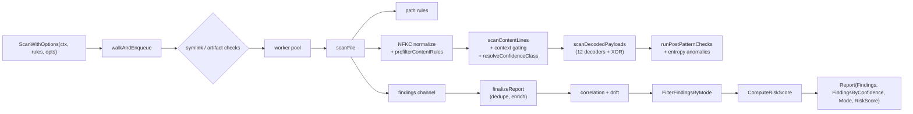

# scan

> Concurrent file scanning engine with payload decoding, NFKC normalization, incremental cache, Aho-Corasick pre-filtering, risk scoring, and tool-context exemptions.

## Responsibility

`internal/scan` is the core detection engine. It walks filesystem roots in parallel, matches rules against file paths and content, applies NFKC Unicode normalization to defeat evasion, decodes obfuscated payloads through a recursive decoder chain, applies Shannon entropy heuristics, computes an aggregate risk score, and aggregates findings into a `model.Report`. It also owns the incremental scan cache (mtime + SHA256 state file), the Aho-Corasick literal-keyword pre-filter, threat-mode filtering (`filter.go`), and tool-context exemptions (`tool_exemptions.go`).

## Public API

### Entry Points

| Symbol | Signature | Description |
|--------|-----------|-------------|
| `ScanWithOptions` | `(ctx context.Context, rules []model.Rule, opts model.ScanOptions) (model.Report, error)` | Primary scan entry point. Bounded concurrent file scanning with context cancellation, worker pool, and report aggregation. |
| `ScanSingleFile` | `(path, root string, pathRules, contentRules []model.Rule, opts ScanFileOptions) ScanFileResult` | Scans one file with given rules. Used by the engine internally and exposed for targeted tests. |

### Rule Helpers

| Symbol | Signature | Description |
|--------|-----------|-------------|
| `SplitRulesByTarget` | `(rules []model.Rule) ([]model.Rule, []model.Rule)` | Partitions rules into path-target and content-target slices. |
| `ShouldSkipDir` | `(profile model.ScanProfile, name string) bool` | Profile-specific directory skip policy (`.git`, `node_modules`, `/proc`, etc.). |

### Finding Utilities

| Symbol | Signature | Description |
|--------|-----------|-------------|
| `DedupeFindings` | `(in []model.Finding) []model.Finding` | Removes duplicates from overlapping checks. |
| `ThresholdExceeded` | `(findings []model.Finding, failOn model.Severity, mode model.ScanMode) bool` | Mode-aware gating: a finding must meet `--fail-on` severity AND be `IsGateEligible` for the active mode. In `developer`, only wedge rule families gate; `ir`/`deep` are advisory. Skips findings with `Suppressed=true`. |
| `SummarizeFindings` | `(findings []model.Finding) map[string]int` | Counts findings by severity for report statistics. Skips findings with `Suppressed=true`. |
| `SortFindings` | `(findings []model.Finding)` | Deterministic ordering for reproducible output. |
| `WorldWritableArtifactFinding` | `(absPath, fileLabel string, info os.FileInfo, redactSecrets bool) (model.Finding, bool)` | Emits `SKN-PROT-001` for world-writable scanner-critical files. |

### Payload Decoders

| Symbol | Signature | Description |
|--------|-----------|-------------|
| `DecodePayloadLayers` | `(raw []byte) []DecodedLayer` | Recursive decoding through 12 encoding schemes (base64, base32, hex, URL, gzip, zlib, PowerShell, Unicode, HTML, ROT13, quoted-printable, PEM). |
| `DecodePayloadLayersWithDepth` | `(raw []byte, maxDepth int) []DecodedLayer` | Recursive decoding with configurable depth (`--max-decode-depth`). Entropy-based bonus adds one extra level when decoded layer entropy > 6.0 bits/byte. |
| `ShannonEntropy` | `(data []byte) float64` | Per-byte Shannon entropy for obfuscation detection. |
| `IsHighEntropy` | `(data []byte, threshold float64) bool` | Tests against entropy threshold (default 6.0 bits/byte). |
| `DetectEntropyAnomalies` | `(data []byte, windowSize, stride int, threshold float64) []EntropyAnomaly` | Sliding-window entropy anomaly detection. Emits `ENC-ENTROPY-001` when 3+ anomalous regions found. |
| `DetectHomoglyphs` | `(s string) bool` | Mixed-script identifier detection for typosquatting. |
| `NormalizeUnicode` | `(s string) string` | Strips zero-width and invisible formatting characters. |
| `TryDecodeXORBrute` | `(data []byte, hintMatcher func([]byte) bool) ([]byte, bool)` | Single-byte XOR brute-force on high-entropy data (capped at 4 KiB). Gated by `--xor-brute`. |
| `DetectPolyglot` | `(prefix []byte) []PolyglotSignature` | Detects binary magic bytes (PE, ELF, PDF, ZIP, gzip, PNG, JFIF) within the first 8 KiB. PE at offset 0 is accepted on `MZ` alone; at non-zero offsets requires a valid PE header (`e_lfanew` and `PE\0\0`). For binary (non-text) files, `ENC-POLYGLOT-001` is emitted only when 3+ distinct signature formats appear; text files still emit per signature. |

### Incremental Cache

| Symbol | Signature | Description |
|--------|-----------|-------------|
| `NewIncrementalStateCache` | `(path, rulesetHash string, enabled bool, logger model.ScanLogger) (*IncrementalStateCache, error)` | Initializes cache with version/ruleset invalidation. |
| `ComputeRulesetHash` | `(rules []model.Rule) string` | Deterministic hash for cache invalidation when rules change. |
| `(*IncrementalStateCache).ShouldScan` | `(absPath string, info os.FileInfo) (bool, error)` | Reports whether a file needs scanning (false = skip via incremental cache). |

### NFKC Normalization

| Symbol | Signature | Description |
|--------|-----------|-------------|
| `NormalizeNFKC` | `(s string) string` | Stdlib-only NFKC subset: fullwidth→ASCII, zero-width strip, Cyrillic/Greek homoglyphs. Fast passthrough for pure ASCII. |

### Risk Scoring

| Symbol | Signature | Description |
|--------|-----------|-------------|
| `ComputeRiskScore` | `(findings []model.Finding) int` | 0–100 aggregate score with diminishing returns per severity. |
| `RollupFindings` | `(findings []model.Finding) []model.Finding` | Groups normalized matches at the same file/line, retaining the strongest primary and secondary rule IDs. |

### Threat-Mode Filtering

| Symbol | Signature | Description |
|--------|-----------|-------------|
| `FindingMatchesThreatMode` | `(f model.Finding, mode model.ThreatMode) bool` | Tests whether a finding belongs to a threat mode via rule ID prefix and category. |
| `FilterFindingsByThreatMode` | `(findings []model.Finding, mode model.ThreatMode) []model.Finding` | Post-scan domain focus filtering. |

### Tool Exemptions

| Symbol | Signature | Description |
|--------|-----------|-------------|
| `ExemptedRulePrefixes` | `(toolName string) []string` | Returns rule ID prefixes to exclude for a given tool context. |

### Pre-filter

| Symbol | Signature | Description |
|--------|-----------|-------------|
| `NewACMatcher` | `(keywords []string) *ACMatcher` | Builds Aho-Corasick automaton from literal-hint keywords. |
| `(*ACMatcher).Match` | `(data []byte) []string` | Returns all matched keywords (each at most once). |
| `(*ACMatcher).MatchAny` | `(data []byte) bool` | Short-circuits on first keyword match. |

### Types

| Type | Description |
|------|-------------|
| `ScanFileOptions` | Per-file scan configuration (max bytes, redaction, style, threat mode, policy). |
| `ScanFileResult` | Per-file output: findings, scanned/skipped counts, errors. |
| `DecodedLayer` | One decoded payload stage: encoding label, content bytes, confidence score. |
| `IncrementalStateCache` | Opaque cache handle; methods: `Enabled`, `Path`, `RulesChanged`, `ShouldScan`, `Record`, `Finalize`, `Save`. |
| `ACMatcher` | Aho-Corasick multi-pattern byte matcher. |

### Constants

| Name | Value | Description |
|------|-------|-------------|
| `DefaultMaxBytes` | 2 MiB | Default per-file read cap. |
| `MaxDecodeInputBytes` | 256 KiB | Decoder input size cap. |
| `DefaultEntropyThresholdBits` | 6.0 | High-entropy cutoff (bits/byte). |
| `ScanStateVersion` | 1 | Incremental cache schema version. |

The unexported `maxScanLines` (500,000) caps per-file line iteration; files exceeding this fall back to raw-content-only matching to prevent OOM on minified files.

## Internal Design

### Worker Pool Architecture

`ScanWithOptions` spawns a configurable number of worker goroutines (default `runtime.NumCPU()`). A filesystem walker enqueues file paths into a bounded channel; workers dequeue, scan, and push findings into a results channel. Both the walker and workers honor `context.Context` cancellation for clean abort.

### Walk-time `SCM-SYM-001` / `SCM-TEMP-001` severity

`SCM-SYM-001` uses Medium for relative symlink targets and High when the target path is absolute. `SCM-TEMP-001` uses Low for binary OS metadata files (for example `.DS_Store`, `Thumbs.db`), Medium for editor swap/backup files and text metadata such as `desktop.ini`.

### Scan Pipeline Per File

`scanFile` orchestrates the per-file pipeline:

1. **Path rules** — regex match against relative path
2. **Symlink/artifact checks** — `SCM-SYM-*`, `SCM-TEMP-*` emitted during walk before content read (`SCM-SYM-001` severity depends on symlink shape: Medium for relative targets, High for absolute targets; `SCM-TEMP-001` uses Low for binary OS metadata such as `.DS_Store`/`Thumbs.db`, Medium for editor swap/backup files and `desktop.ini`)
3. **NFKC normalization** — `NormalizeNFKC` applied to lowered content and per-line before regex matching (when `--nfkc` enabled)
4. **`prefilterContentRules`** — Aho-Corasick or `strings.Contains` literal-hint filter to reduce eligible rules
5. **Polyglot detection** — `DetectPolyglot` on file prefix before text check; `ENC-POLYGLOT-001` uses stricter PE validation for non-zero offsets; binary files require 3+ distinct signature formats before emitting (see `DetectPolyglot` description above)
6. **`scanContentLines`** — line-by-line regex with `ContextPattern`/`ContextWindow` co-occurrence gating; optional per-rule `ExcludePattern` suppresses a match when the matched line also matches that regex; `Remediation` propagated to findings
7. **`scanDecodedPayloads`** — decoded content (12 encoding schemes) re-matched against eligible rules; optional XOR brute-force (`--xor-brute`) on high-entropy layers
8. **`runPostPatternChecks`** — policy checks, behavior chains, focus checks, `checks.CheckDomainTyposquat` (`DOM-TYPO-001`–`003`), entropy anomaly detection (`ENC-ENTROPY-001`)
9. **World-writable check** — `SKN-PROT-001` for sensitive file permissions

Files exceeding `maxScanLines` (500k lines) fall back to raw-content-only matching, skipping per-line iteration to prevent OOM on minified files.

### Aho-Corasick Pre-filter

At startup, `LiteralHint` strings from all content rules are collected into an `ACMatcher`. Before running regex on a file's content, the engine runs `MatchAny` on the raw bytes. Files with no literal-hint matches skip the regex phase entirely, dramatically reducing scan time on large codebases.

### Confidence Propagation and Mode Filtering

`resolveConfidenceClass` is called when constructing each finding in `worker.go`, using the rule's `ConfidenceClass` override when set, otherwise `model.DefaultConfidenceForRuleID`. `finalizeReport` then runs correlation, deduplication, threat/mode filters, sorting, summaries, risk scoring, and populates `report.FindingsByConfidence` and `report.Mode`. `ThresholdExceeded` integrates mode-aware gating via `model.IsGateEligible`.

### Incremental Cache

The cache stores `{mtime, size, SHA256, last-scanned-at}` per file. On repeat scans: if mtime and size match, the file is skipped. If size matches but mtime differs, SHA256 is recomputed. A ruleset hash invalidates all entries when rules change.

## Dependencies

| Package | Why |
|---------|-----|
| `internal/model` | `Rule`, `Finding`, `Report`, `ScanOptions`, severity/style/profile types |
| `internal/security` | `SanitizeMatch` for redaction, `SHA256FileHex` for incremental cache |
| `internal/logging` | Logger for verbose/debug output during scan |
| `internal/checks` | Post-scan policy, behavior, dependency, graph, and focus checks |
| `internal/correlation` | Cross-finding correlation and drift detection |

## Data Flow



## Test Surface

| File | Coverage |
|------|----------|
| `engine_test.go` | Cancellation, concurrency, max-files/findings enforcement, permission errors, corrupt cache |
| `incremental_test.go` | Cache lifecycle, rules-changed invalidation, deterministic hash, save/load |
| `decoders_test.go` | All 12 decoders (base64, base32, hex, URL, gzip, zlib, PowerShell, Unicode, HTML, ROT13, quoted-printable, PEM), nesting, non-text rejection, entropy, homoglyphs, Unicode normalization |
| `xor_decoder_test.go` | XOR brute-force decoding with known key, low-entropy rejection |
| `entropy_test.go` | Sliding-window entropy anomaly detection and merging |
| `polyglot_test.go` | Binary magic byte detection (PE, ELF, PDF, ZIP, gzip, PNG, JFIF) at various offsets |
| `decoders_fuzz_test.go` | Fuzz targets for `DecodePayloadLayers` and `ShannonEntropy` |
| `prefilter_test.go` | AC matcher: basic, no-match, overlapping, empty, large input |
| `helpers_regression_test.go` | `ShouldSkipDir`, `ThresholdExceeded`, `WorldWritableArtifactFinding`, path/permission heuristics |
| `rule_family_regression_test.go` | Rule family detection, threat mode filtering, redaction, behavior style, fail-on semantics |
| `normalize_test.go` | NFKC: fullwidth, zero-width, homoglyphs, passthrough, benchmarks |

```bash
go test ./internal/scan -count=1
go test ./internal/scan -count=1 -fuzz .
go test ./internal/scan -count=1 -race
```

## Related Docs

- [ARCHITECTURE.md](../ARCHITECTURE.md) — scan engine section
- [rules module](rules.md) — produces `[]Rule` consumed here; `LiteralHint` feeds the AC pre-filter
- [checks module](checks.md) — post-scan enrichment called from `ScanWithOptions`
- [correlation module](correlation.md) — cross-finding correlation called post-scan
- [CONFIGURATION.md](../CONFIGURATION.md) — `--workers`, `--max-bytes`, `--incremental`, `--state-cache`
